# C++ <a name="c++"></a>
¡Hola a todos los jóvenes programadores curiosos!

Hoy vamos a adentrarnos en un mundo fascinante: ¡la programación en C++! ¿Alguna vez te preguntaste cómo las computadoras entienden lo que les decimos? ¡Es todo gracias al código de máquina, que está formado solo por ceros y unos! Pero, ¿cómo logramos hablar con las computadoras de manera más fácil?

Existen diferentes "idiomas" que usamos para comunicarnos con las computadoras, como Java, Python, JavaScript y otros. Estos se llaman lenguajes modernos. Pero también hay otros, como los lenguajes ensambladores, que son como lenguajes más cercanos a la computadora. Aquí es donde entra en juego el C++, ¡que es súper emocionante!


Antes de comenzar este viaje, necesitamos prepararnos y entender qué es C++ y los lenguajes de alto y bajo nivel.

## lenguajes de alto y bajo nivel

Los lenguajes de programación son una forma de comunicarse con las computadoras, que son máquinas capaces de realizar operaciones lógicas y matemáticas a gran velocidad. Sin embargo, las computadoras no entienden el lenguaje humano, sino que solo pueden procesar instrucciones binarias, es decir, secuencias de ceros y unos que representan datos y comandos. Estas instrucciones binarias se conocen como lenguaje de máquina, y son el nivel más bajo de programación que existe.

Pero escribir programas en lenguaje de máquina es muy difícil y tedioso, ya que requiere conocer el funcionamiento interno de la computadora, y escribir largas cadenas de bits que son difíciles de leer y depurar. Por eso, los programadores han creado otros lenguajes de programación más fáciles de usar y entender, que se conocen como lenguajes de alto nivel. Estos lenguajes utilizan palabras, símbolos y estructuras que se parecen más al lenguaje humano, y que permiten expresar algoritmos y soluciones de forma más clara y concisa. Algunos ejemplos de lenguajes de alto nivel son Python, Java, Ruby, JavaScript, etc.

Sin embargo, los lenguajes de alto nivel no se pueden ejecutar directamente por la computadora, sino que tienen que ser traducidos al lenguaje de máquina. Esto se puede hacer de dos formas: mediante un compilador o mediante un intérprete. Un compilador es un programa que convierte todo el código fuente de un lenguaje de alto nivel en un archivo ejecutable de lenguaje de máquina, que se puede ejecutar en la computadora. Un intérprete es un programa que lee y ejecuta el código fuente de un lenguaje de alto nivel línea por línea, sin generar un archivo ejecutable. Cada forma tiene sus ventajas y desventajas, pero en general, los programas compilados suelen ser más rápidos y eficientes, mientras que los programas interpretados suelen ser más flexibles y portables.

Entre los lenguajes de alto nivel y el lenguaje de máquina, hay otro nivel intermedio de programación, que se conoce como lenguaje de bajo nivel. Estos lenguajes son más cercanos al hardware que los lenguajes de alto nivel, pero más fáciles de usar que el lenguaje de máquina. Estos lenguajes utilizan instrucciones que se corresponden con las operaciones del procesador, y que se pueden representar mediante mnemónicos, que son abreviaturas de palabras clave. Estas instrucciones se conocen como lenguaje ensamblador, y se pueden traducir al lenguaje de máquina mediante un programa llamado ensamblador. Algunos ejemplos de lenguajes de bajo nivel son C, C++, Fortran, etc.

Los lenguajes de bajo nivel tienen la ventaja de que permiten un mayor control y rendimiento sobre el sistema, pero también tienen la desventaja de que requieren un mayor conocimiento y responsabilidad sobre los recursos y las operaciones del hardware, como la memoria, los registros, los puertos, los dispositivos de entrada y salida, etc. Además, los lenguajes de bajo nivel suelen ser menos portables y más dependientes de la arquitectura y el compilador de la máquina.

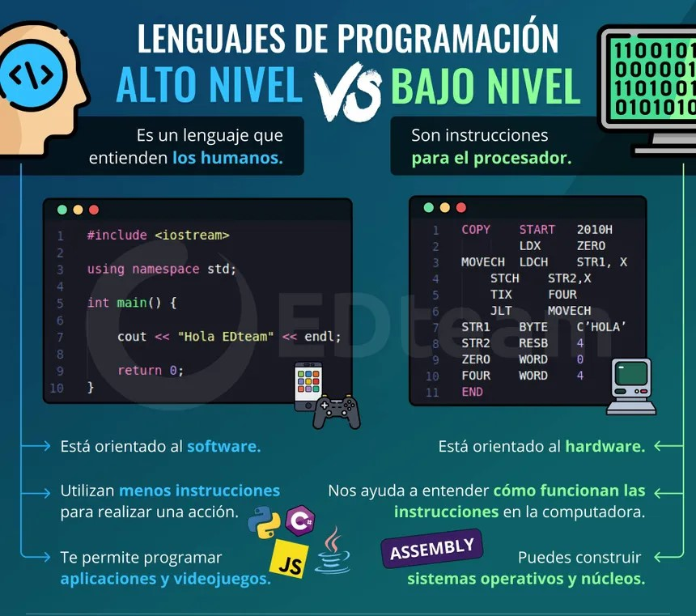

En este curso, nos centraremos en uno de los lenguajes de bajo nivel más populares y poderosos que existen: C++. C++ es un lenguaje de programación que se basa en el lenguaje C, pero que añade algunas características que lo hacen más versátil y expresivo, como la programación orientada a objetos, la sobrecarga de operadores, las plantillas, las excepciones, etc. C++ también permite al programador elegir el nivel de abstracción que desea utilizar, desde el más bajo, que es casi equivalente al lenguaje ensamblador, hasta el más alto, que es similar a otros lenguajes de alto nivel. Esto hace que C++ sea un lenguaje multiparadigma, que se adapta a diferentes tipos de problemas y soluciones.


## **¿Qué es C++?**<a name="que-es-c++"></a>
C++ es un lenguaje de programación poderoso y extremadamente versátil. ¿Sabías que muchos videojuegos geniales como Minecraft o programas populares como Photoshop están escritos en C++? ¡Es realmente increíble cómo este lenguaje puede dar vida a cosas tan asombrosas!

C++ es conocido por su capacidad para mezclar la programación orientada a objetos con la programación más tradicional. Fue creado como una extensión del lenguaje de programación C en la década de 1980 y ha crecido para convertirse en uno de los lenguajes más utilizados en la programación de sistemas, videojuegos y aplicaciones.

**El Camino de C++**
Piensa en C++ como una caja de herramientas gigante. Puedes usarla para construir casi cualquier cosa: desde juegos épicos hasta programas que resuelven problemas matemáticos complejos. Su versatilidad lo hace súper emocionante.

Al igual que los superhéroes tienen diferentes habilidades, C++ puede manejar muchos desafíos informáticos. Puede hacer que las computadoras piensen, creen y solucionen problemas de manera rápida y eficiente.

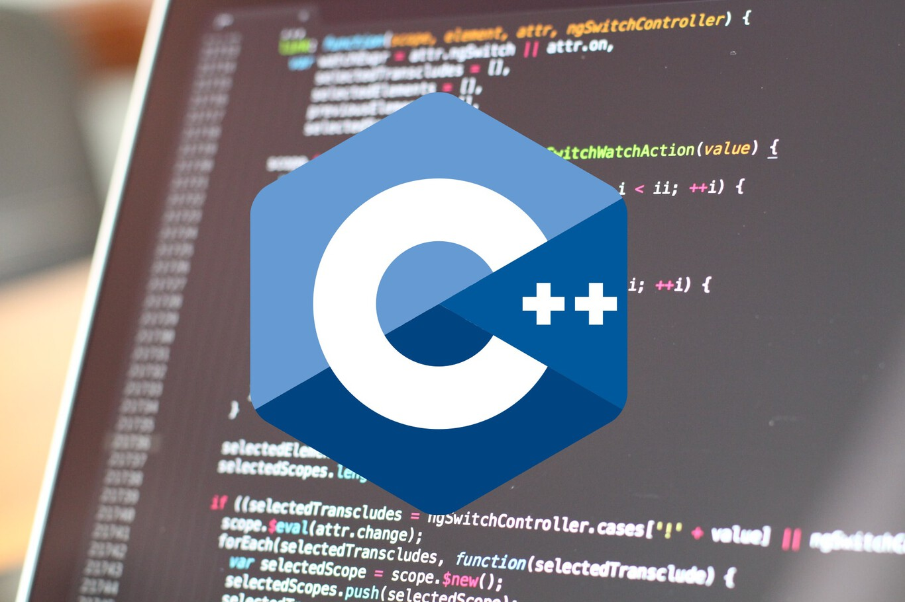

**¿Por qué Aprender C++?**
Te estarás preguntando, ¿por qué deberías aprender C++? ¡Aquí hay algunas razones emocionantes!

- Poder y Velocidad: C++ está cerca del corazón de las computadoras, lo que lo hace rápido y eficiente para resolver problemas complejos.
- Flexibilidad: Puedes usar C++ para construir casi cualquier cosa: desde aplicaciones de teléfonos móviles hasta sistemas operativos.
- Desafíos emocionantes: Si te gustan los desafíos y resolver problemas intrigantes, C++ te ofrecerá un montón de diversión.
- ¡El Futuro Es Tuyo!: Grandes compañías como Microsoft, Amazon y Sony buscan desarrolladores de C++ para crear nuevos y emocionantes proyectos.


## **Variables** <a name="variables"></a>

Imagina una caja mágica que puede guardar información. Esa caja es una variable. En el mundo de la programación, las variables son como cajitas donde podemos guardar números, palabras o información importante para usarla más tarde.

En C++, una variable tiene un nombre y un valor asociado. Por ejemplo, si queremos guardar la edad de alguien:

<!-- ```cpp
int edad = 12;
``` -->
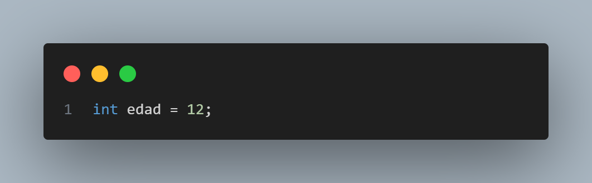

Aquí, "edad" es el nombre de la variable y "12" es el valor que está almacenando.

**Reglas para Crear Variables**

Hay algunas reglas para nombrar variables en C++. Debes recordar que:

- Los nombres de las variables pueden tener letras o números, y a veces el guion bajo (_), pero no es recomendable comenzar con un número.
- ¡Atención! Las variables no pueden comenzar con mayúsculas.

**Constantes: Valores que no Cambian**

Ahora, imagina una caja especial que tiene un valor que nunca cambia. Esa es una constante. En C++, usamos la palabra reservada "const" para definir constantes:

<!-- ```cpp
const int VALOR_CONSTANTE = 100;
``` -->
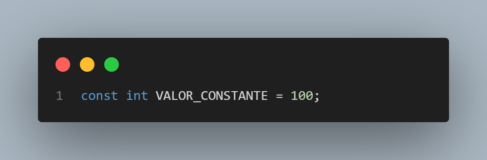

Aquí, "VALOR_CONSTANTE" es una constante y no podemos cambiar su valor más adelante en el programa.

**Declaración estática de variables**

La declaración estática de variables se hace mediante la especificación del tipo de dato y el nombre de la variable, opcionalmente seguido de un valor inicial. Por ejemplo:

<!-- ```cpp
int x; // declara una variable de tipo entero llamada x, sin asignarle un valor
char c = 'a'; // declara una variable de tipo carácter llamada c, y le asigna el valor 'a'
``` -->
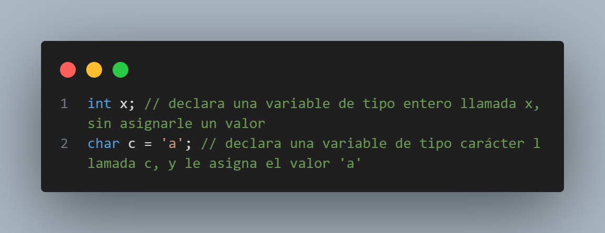

La declaración estática de variables tiene la ventaja de que es más rápida y eficiente, ya que el compilador sabe de antemano cuánta memoria necesita reservar y dónde ubicarla. Además, el compilador puede hacer comprobaciones de tipos y errores en tiempo de compilación, lo que evita posibles fallos en tiempo de ejecución. Sin embargo, la declaración estática de variables también tiene la desventaja de que es más rígida y limitada, ya que el tamaño y la ubicación de la memoria de la variable no se pueden cambiar una vez que se ha declarado. Esto puede provocar problemas de desperdicio o escasez de memoria, si el tamaño de la variable es mayor o menor que el necesario.

**Declaración dinámica de variables**

La declaración dinámica de variables se hace mediante el uso de los operadores `new` y `delete`, que permiten asignar y liberar memoria en tiempo de ejecución. El operador `new` reserva una cantidad de memoria suficiente para almacenar un valor de un tipo determinado, y devuelve un puntero a esa zona de memoria. El operador `delete` libera la memoria que ha sido asignada previamente por el operador `new`, y evita que el puntero apunte a una zona de memoria inválida. Por ejemplo:

<!-- ```cpp
int* p = new int; // declara un puntero a entero llamado p, y le asigna una zona de memoria para un entero
*p = 10; // accede y modifica el valor de la zona de memoria apuntada por p
delete p; // libera la memoria asignada por el operador new, y evita que p apunte a una zona de memoria inválida
``` -->
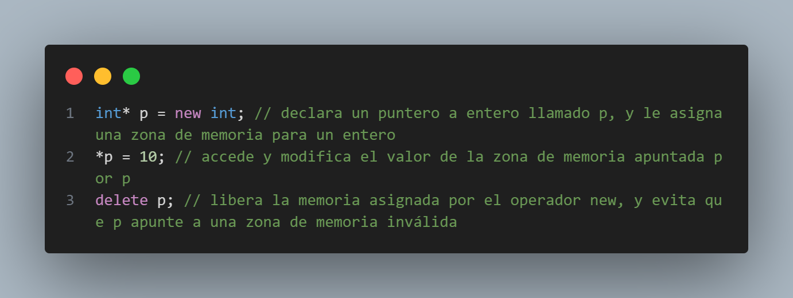

La declaración dinámica de variables tiene la ventaja de que es más flexible y adaptable, ya que el tamaño y la ubicación de la memoria de la variable se pueden cambiar según las necesidades del programa. Esto permite crear estructuras de datos dinámicas, como arreglos, listas, árboles, etc. Sin embargo, la declaración dinámica de variables también tiene la desventaja de que es más lenta y compleja, ya que el programador es responsable de asignar y liberar la memoria correctamente, y de evitar posibles errores, como fugas de memoria, corrupción de datos, o acceso a zonas de memoria no válidas.

## **Tipos de Datos en C++** <a name="tipos-datos"></a>

En C++, tenemos diferentes tipos de datos para diferentes tipos de información que queremos almacenar. Los más comunes son:

- **int**: Para números enteros (ejemplo: 10, -5, 1000).
- **float y double**: Para números decimales o flotantes (ejemplo: 3.14, 0.5, 9.99).
- **char**: Para caracteres individuales (ejemplo: 'a', 'B', '$').
- **bool**: Para valores de verdadero (true) o falso (false).

Cada tipo de dato tiene un tamaño específico que determina cuánta información puede almacenar.


- Tipos enteros: son los que representan números enteros, es decir, sin parte decimal. Se pueden dividir en dos categorías: con signo y sin signo. Los tipos enteros con signo pueden representar números positivos y negativos, mientras que los tipos enteros sin signo solo pueden representar números positivos. Los tipos enteros más comunes son `char`, `short`, `int`, `long` y `long long`.
- Tipos reales: son los que representan números reales, es decir, con parte decimal. Se pueden dividir en dos categorías: de precisión simple y de precisión doble. Los tipos reales de precisión simple pueden representar números con menos decimales, pero ocupan menos memoria. Los tipos reales de precisión doble pueden representar números con más decimales, pero ocupan más memoria. Los tipos reales más comunes son `float` y `double`.
- Tipo carácter: es el que representa un carácter, es decir, un símbolo alfanumérico o especial. El tipo carácter más común es `char`, que puede representar un carácter del conjunto ASCII, que tiene 128 símbolos. También existe el tipo `wchar_t`, que puede representar un carácter del conjunto Unicode, que tiene más de 100000 símbolos.
- Tipo booleano: es el que representa un valor lógico, es decir, verdadero o falso. El tipo booleano más común es `bool`, que puede representar los valores `true` o `false`.

En la siguiente tabla se muestra el tamaño y el rango de los tipos de datos básicos en C++, asumiendo que se usa una arquitectura de 32 bits y un compilador estándar:

| Tipo de dato | Tamaño (bytes) | Rango |
|--------------|----------------|-------|
| char         | 1              | -128 a 127 |
| unsigned char | 1             | 0 a 255 |
| short        | 2              | -32768 a 32767 |
| unsigned short | 2            | 0 a 65535 |
| int          | 4              | -2147483648 a 2147483647 |
| unsigned int | 4              | 0 a 4294967295 |
| long         | 4              | -2147483648 a 2147483647 |
| unsigned long | 4             | 0 a 4294967295 |
| long long    | 8              | -9223372036854775808 a 9223372036854775807 |
| unsigned long long | 8        | 0 a 18446744073709551615 |
| float        | 4              | ±1.17549435e-38 a ±3.40282347e+38 |
| double       | 8              | ±2.2250738585072014e-308 a ±1.7976931348623157e+308 |
| wchar_t      | 2 o 4          | depende del compilador |
| bool         | 1              | true o false |


#### ***Tipos string***

Tipos de cadena de caracteres En C++, no existe un tipo de dato especial para guardar cadenas de caracteres, como palabras o frases. Lo que sí existe son los tipos `char` y `wchar_t`, que sirven para guardar un solo carácter, como una letra o un signo. Para guardar una cadena de caracteres, hay que usar un arreglo de estos tipos, y poner un valor especial al final para indicar dónde termina la cadena (por ejemplo, ‘\0’ en ASCII). A este tipo de cadenas se les llama cadenas de estilo C, y son las que se usaban en el lenguaje C original. El problema de las cadenas de estilo C es que son difíciles de manejar y requieren usar funciones externas para hacer operaciones con ellas. Por eso, en C++ moderno, se recomienda usar los tipos de la biblioteca estándar `std::string` (para cadenas de caracteres de tipo char de 8 bits) o `std::wstring` (para cadenas de caracteres de tipo `wchar_t` de 16 bits). Estos tipos son como contenedores que guardan y manipulan cadenas de caracteres de forma más fácil y segura, y forman parte de las bibliotecas que vienen con cualquier compilador de C++ compatible. Para usar estos tipos, hay que incluir la directiva `#include <string>` en el programa. (También existe el tipo CString, que se usa con las bibliotecas MFC o ATL, pero no es parte del estándar de C++). El uso de arreglos de caracteres terminados en NULL (las cadenas de estilo C mencionadas antes) no se aconseja en C++ actual.


un ejemplo claro de esto sería el siguiente:

<!-- ```cpp
#include <string> // se necesita esta directiva para usar los tipos string

// declaración estática de variables de tipo string
std::string nombre = "Juan"; // se declara una variable de tipo string llamada nombre, y se le asigna el valor "Juan"
std::wstring saludo = L"Hola"; // se declara una variable de tipo wstring llamada saludo, y se le asigna el valor "Hola"

// declaración dinámica de variables de tipo string
std::string* mensaje = new std::string("Bienvenido"); // se declara un puntero a string llamado mensaje, y se le asigna una zona de memoria para un string con el valor "Bienvenido"
std::wstring* despedida = new std::wstring(L"Adiós"); // se declara un puntero a wstring llamado despedida, y se le asigna una zona de memoria para un wstring con el valor "Adiós"

// uso de variables de tipo string
std::cout << nombre << std::endl; // se imprime el valor de la variable nombre en la salida estándar
std::wcout << saludo << std::endl; // se imprime el valor de la variable saludo en la salida estándar
std::cout << *mensaje << std::endl; // se imprime el valor de la zona de memoria apuntada por el puntero mensaje en la salida estándar
std::wcout << *despedida << std::endl; // se imprime el valor de la zona de memoria apuntada por el puntero despedida en la salida estándar

// liberación de la memoria asignada dinámicamente
delete mensaje; // se libera la memoria asignada por el operador new para el puntero mensaje
delete despedida; // se libera la memoria asignada por el operador new para el puntero despedida

``` -->
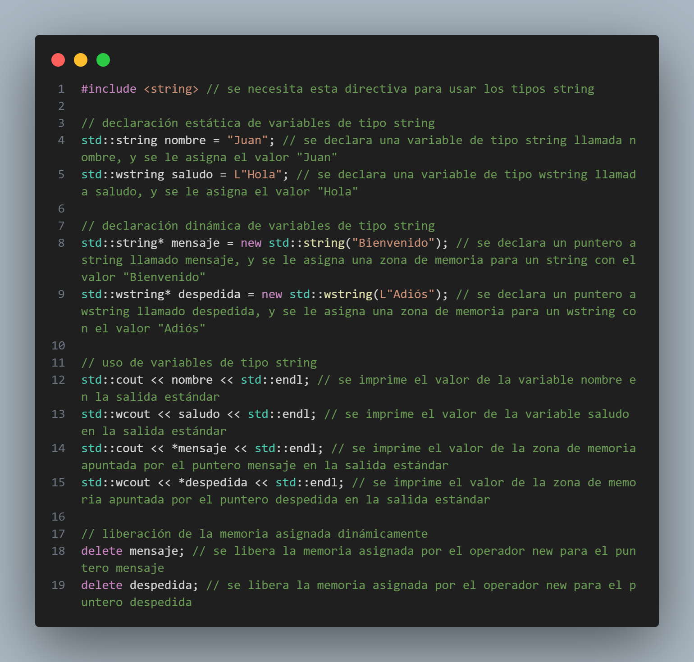

Ahora veremos cómo escribir y ejecutar nuestro primer programa en C++, que consiste en mostrar el mensaje "Hola mundo :D" en la pantalla. Para ello, necesitamos un editor de texto, donde escribiremos el código fuente del programa, y un compilador, que traducirá el código fuente a un archivo ejecutable que se puede ejecutar en la computadora. Hay muchos editores de texto y compiladores disponibles, pero en este caso, usaremos el editor dev c++.

El código fuente de nuestro primer programa en C++ es el siguiente:

```cpp
//Primer programa en c++

using namespace std;

#include<iostream>

int main(){

    cout<<"Hola mundo :D"<<endl;

    cout<<"Hola mundo :D\n";

    return 0;
}
```

Veamos qué significa cada línea de este código:

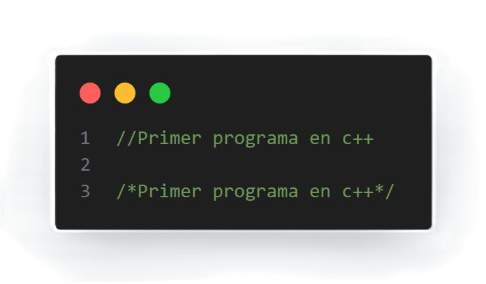

- La primera línea es un comentario, que sirve para añadir información o explicaciones al código, pero que no afecta al funcionamiento del programa. Los comentarios se pueden escribir de dos formas: con dos barras (//) para comentarios de una sola línea, o con una barra y un asterisco (/*) para comentarios de varias líneas, que se cierran con un asterisco y una barra (\*/). En este caso, el comentario indica el propósito del programa.
  
    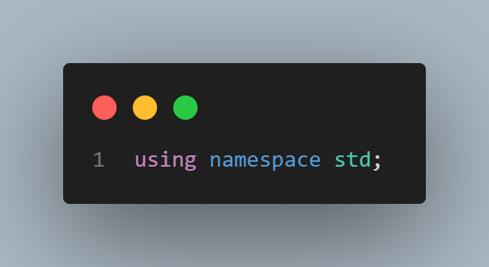
    
- La segunda línea es una directiva de preprocesador, que sirve para dar instrucciones al compilador antes de traducir el código fuente. Las directivas de preprocesador se escriben con una almohadilla (#) al principio. En este caso, la directiva using namespace std le dice al compilador que use el espacio de nombres estándar, que es donde se encuentran las funciones y los tipos de la biblioteca estándar de C++, como cout, string, vector, etc. Esto nos evita tener que escribir el nombre completo de cada función o tipo, como std::cout o std::string, cada vez que los usemos.

    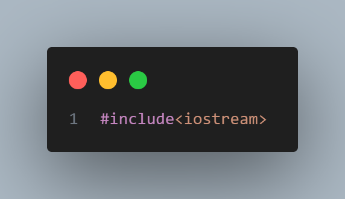
    
- La tercera línea es otra directiva de preprocesador, que sirve para incluir el contenido de otro archivo en el código fuente. En este caso, la directiva `#include<iostream>` incluye el contenido del archivo iostream, que es el que contiene las funciones y los tipos para hacer operaciones de entrada y salida, como leer datos del teclado o mostrar datos en la pantalla. El nombre del archivo se escribe entre paréntesis angulares (< >) si se trata de un archivo de la biblioteca estándar, o entre comillas dobles (" ") si se trata de un archivo propio o de terceros.

    

- La quinta línea es la definición de la función principal del programa, que se llama main. La función main es la que se ejecuta al iniciar el programa, y es la que contiene las instrucciones que se quieren realizar. La función main se escribe con la palabra reservada int, que indica el tipo de dato que devuelve la función, seguida del nombre de la función, y unos paréntesis que pueden contener parámetros, que son valores que se le pasan a la función. En este caso, la función main no tiene parámetros, por lo que los paréntesis están vacíos. Después de los paréntesis, se abre una llave ({), que indica el inicio del cuerpo de la función, donde se escriben las instrucciones.

    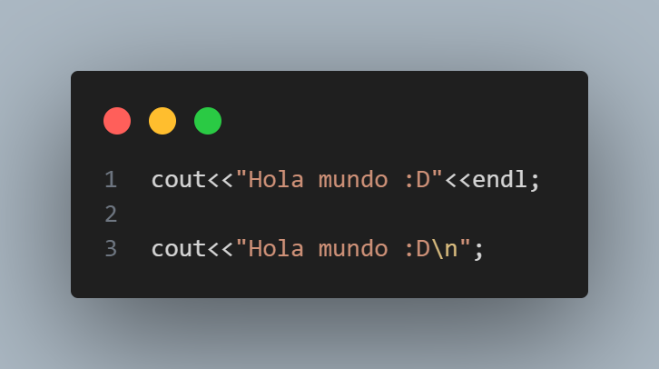

- La sexta línea es una instrucción, que sirve para realizar una acción o una operación en el programa. Las instrucciones se escriben con una o más expresiones, que son combinaciones de valores, variables, operadores y funciones, que producen un resultado. Las instrucciones se terminan con un punto y coma (\;), que indica el final de la instrucción. En este caso, la instrucción es `cout<<"Hola mundo :D"<<endl;`, que sirve para mostrar el mensaje "Hola mundo :D" en la pantalla, seguido de un salto de línea. La expresión `cout` es un objeto de la clase *ostream*, que representa el flujo de salida estándar, es decir, la pantalla. El operador `<<` es un operador de inserción, que sirve para enviar un valor al flujo de salida. El valor que se envía es "Hola mundo :D", que es una cadena de caracteres, es decir, una secuencia de caracteres entre comillas dobles. El valor `endl` es otro objeto de la clase *ostream*, que representa el fin de línea, es decir, un carácter especial que hace que el cursor se mueva a la siguiente línea. Al usar el operador `<<` con `cout` y `endl`, se consigue mostrar el mensaje en la pantalla y pasar a la siguiente línea.
- La séptima línea es otra instrucción, que sirve para mostrar el mismo mensaje que la anterior, pero con una forma diferente. En este caso, la instrucción es `cout<<"Hola mundo :D\n";`, que también usa el objeto cout y el operador `<<`, pero en lugar de usar el objeto endl, usa el carácter especial `\n`, que también representa el fin de línea. El carácter `\n` se escribe dentro de la cadena de caracteres, precedido de una barra invertida (\\), que indica que se trata de un carácter de escape, es decir, un carácter que tiene un significado especial y que no se muestra literalmente. Hay otros caracteres de escape, como `\t` (tabulación), `\r` (retorno de carro), `\` (barra invertida), \" (comillas dobles), etc. Al usar el carácter `\n` con `cout`, se consigue el mismo efecto que con `endl`, pero con menos caracteres.

    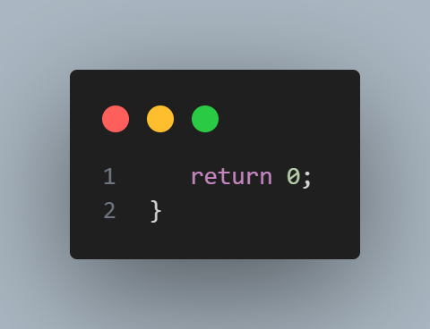

- La octava línea es la última instrucción de la función main, que sirve para devolver un valor al finalizar el programa. En este caso, la instrucción es `return 0;`, que devuelve el valor 0, que indica que el programa ha terminado correctamente. La palabra reservada `return` indica que se quiere devolver un valor, y el valor que se devuelve debe ser del mismo tipo que el que se ha especificado al definir la función. En este caso, la función `main` tiene el tipo `int`, que es un tipo entero, por lo que el valor que se devuelve debe ser un número entero. El valor 0 se usa por convención para indicar que el programa ha terminado sin errores, pero se puede usar cualquier otro valor entero para indicar otros tipos de finalización, como errores o excepciones.
- La novena línea es una llave de cierre (}), que indica el final del cuerpo de la función main, y por tanto, el final del programa.

Este es el código fuente de nuestro primer programa en C++, que muestra el mensaje "Hola mundo :D" en la pantalla. Para ejecutarlo, hay que guardar el código fuente en un archivo con extensión .cpp, como por ejemplo, hola_mundo.cpp, y luego usar el compilador dev c++ damos clic en execute y luego en compile & run.

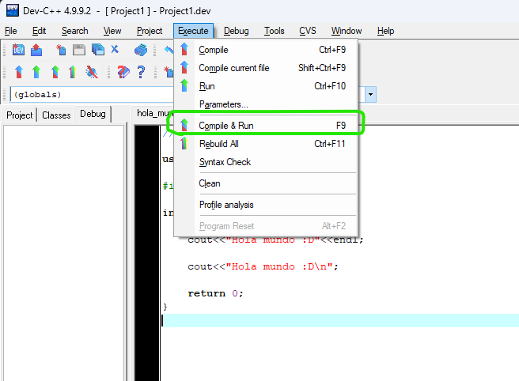

Este comando le dice al sistema operativo que ejecute el archivo hola_mundo.exe, y que muestre el resultado en la pantalla. Si todo ha ido bien, se debería ver el siguiente resultado:

<!-- ```cmd
Hola mundo :D
Hola mundo :D
``` -->
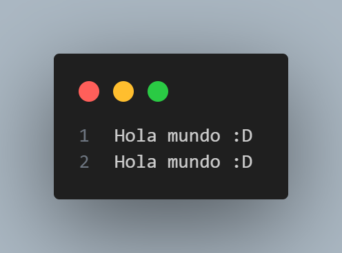

Este es el resultado de nuestro primer programa en C++, que muestra el mensaje "Hola mundo :D" en la pantalla, dos veces, una con endl y otra con \n. Con esto, hemos aprendido los conceptos básicos de C++.

## Variables en C++: ¿Qué son, cómo se usan y cómo se gestionan?

Las variables son uno de los conceptos más fundamentales de la programación, y también uno de los más útiles. Una variable es un espacio de memoria que se reserva para almacenar un valor, que puede cambiar durante la ejecución del programa. Las variables nos permiten guardar y manipular datos, como números, caracteres, cadenas, booleanos, etc. Las variables también tienen un nombre, que es la forma de identificarlas y acceder a ellas en el código.

En C++, las variables se pueden declarar de dos formas: estática o dinámica. La declaración estática significa que el tamaño y la ubicación de la memoria de la variable se determinan en tiempo de compilación, y no se pueden modificar en tiempo de ejecución. La declaración dinámica significa que el tamaño y la ubicación de la memoria de la variable se determinan en tiempo de ejecución, y se pueden modificar según las necesidades del programa. Veamos las diferencias y las ventajas de cada forma.

## Declaración estática de variables

La declaración estática de variables se hace mediante la especificación del tipo de dato y el nombre de la variable, opcionalmente seguido de un valor inicial. Por ejemplo:

```cpp
int x; // declara una variable de tipo entero llamada x, sin asignarle un valor
char c = 'a'; // declara una variable de tipo carácter llamada c, y le asigna el valor 'a'
```

La declaración estática de variables tiene la ventaja de que es más rápida y eficiente, ya que el compilador sabe de antemano cuánta memoria necesita reservar y dónde ubicarla. Además, el compilador puede hacer comprobaciones de tipos y errores en tiempo de compilación, lo que evita posibles fallos en tiempo de ejecución. Sin embargo, la declaración estática de variables también tiene la desventaja de que es más rígida y limitada, ya que el tamaño y la ubicación de la memoria de la variable no se pueden cambiar una vez que se ha declarado. Esto puede provocar problemas de desperdicio o escasez de memoria, si el tamaño de la variable es mayor o menor que el necesario.

## Declaración dinámica de variables

La declaración dinámica de variables se hace mediante el uso de los operadores `new` y `delete`, que permiten asignar y liberar memoria en tiempo de ejecución. El operador `new` reserva una cantidad de memoria suficiente para almacenar un valor de un tipo determinado, y devuelve un puntero a esa zona de memoria. El operador `delete` libera la memoria que ha sido asignada previamente por el operador `new`, y evita que el puntero apunte a una zona de memoria inválida. Por ejemplo:

```cpp
int* p = new int; // declara un puntero a entero llamado p, y le asigna una zona de memoria para un entero
*p = 10; // accede y modifica el valor de la zona de memoria apuntada por p
delete p; // libera la memoria asignada por el operador new, y evita que p apunte a una zona de memoria inválida
```

La declaración dinámica de variables tiene la ventaja de que es más flexible y adaptable, ya que el tamaño y la ubicación de la memoria de la variable se pueden cambiar según las necesidades del programa. Esto permite crear estructuras de datos dinámicas, como arreglos, listas, árboles, etc. Sin embargo, la declaración dinámica de variables también tiene la desventaja de que es más lenta y compleja, ya que el programador es responsable de asignar y liberar la memoria correctamente, y de evitar posibles errores, como fugas de memoria, corrupción de datos, o acceso a zonas de memoria no válidas.

## Tipos de datos y tamaño de la memoria

Los tipos de datos son una forma de clasificar y representar la información que se almacena y se procesa en la computadora. Los tipos de datos básicos son los números enteros, los números reales, los caracteres, los booleanos, etc. Cada tipo de dato tiene un tamaño y un rango determinados, que dependen de la arquitectura y el compilador de la máquina. El tamaño de un tipo de dato indica cuántos bytes ocupa en la memoria, y el rango indica los valores mínimos y máximos que puede representar. Por ejemplo, un número entero puede ocupar 4 bytes (32 bits) y tener un rango de -2^31 a 2^31-1.

Los tipos de datos son importantes porque determinan cómo se almacena y se manipula la información en la memoria de la computadora. El tamaño de un tipo de dato afecta al espacio de memoria que se necesita reservar para una variable, y al rendimiento del programa. El rango de un tipo de dato afecta a la precisión y la exactitud de la información que se puede representar y procesar. Por eso, es importante elegir el tipo de dato adecuado para cada variable, según el tipo y el tamaño de la información que se quiere almacenar y manipular.

En C++, los tipos de datos básicos se pueden clasificar en los siguientes grupos:

- Tipos enteros: son los que representan números enteros, es decir, sin parte decimal. Se pueden dividir en dos categorías: con signo y sin signo. Los tipos enteros con signo pueden representar números positivos y negativos, mientras que los tipos enteros sin signo solo pueden representar números positivos. Los tipos enteros más comunes son `char`, `short`, `int`, `long` y `long long`.
- Tipos reales: son los que representan números reales, es decir, con parte decimal. Se pueden dividir en dos categorías: de precisión simple y de precisión doble. Los tipos reales de precisión simple pueden representar números con menos decimales, pero ocupan menos memoria. Los tipos reales de precisión doble pueden representar números con más decimales, pero ocupan más memoria. Los tipos reales más comunes son `float` y `double`.
- Tipo carácter: es el que representa un carácter, es decir, un símbolo alfanumérico o especial. El tipo carácter más común es `char`, que puede representar un carácter del conjunto ASCII, que tiene 128 símbolos. También existe el tipo `wchar_t`, que puede representar un carácter del conjunto Unicode, que tiene más de 100000 símbolos.
- Tipo booleano: es el que representa un valor lógico, es decir, verdadero o falso. El tipo booleano más común es `bool`, que puede representar los valores `true` o `false`.

En la siguiente tabla se muestra el tamaño y el rango de los tipos de datos básicos en C++, asumiendo que se usa una arquitectura de 32 bits y un compilador estándar:

| Tipo de dato | Tamaño (bytes) | Rango |
|--------------|----------------|-------|
| char         | 1              | -128 a 127 |
| unsigned char | 1             | 0 a 255 |
| short        | 2              | -32768 a 32767 |
| unsigned short | 2            | 0 a 65535 |
| int          | 4              | -2147483648 a 2147483647 |
| unsigned int | 4              | 0 a 4294967295 |
| long         | 4              | -2147483648 a 2147483647 |
| unsigned long | 4             | 0 a 4294967295 |
| long long    | 8              | -9223372036854775808 a 9223372036854775807 |
| unsigned long long | 8        | 0 a 18446744073709551615 |
| float        | 4              | ±1.17549435e-38 a ±3.40282347e+38 |
| double       | 8              | ±2.2250738585072014e-308 a ±1.7976931348623157e+308 |
| wchar_t      | 2 o 4          | depende del compilador |
| bool         | 1              | true o false |


## ¿Qué son las variables?

Una variable es un espacio de memoria que tiene un nombre y un tipo, y que puede almacenar un valor. El nombre de la variable nos permite identificarla y acceder a ella, y el tipo de la variable nos indica qué clase de datos puede almacenar y cómo se interpretan. Por ejemplo, una variable de tipo `int` puede almacenar números enteros, y una variable de tipo `string` puede almacenar cadenas de texto.

Para declarar una variable en C++, debemos escribir el tipo de la variable seguido del nombre de la variable, y opcionalmente podemos asignarle un valor inicial. Por ejemplo:

```c++
int edad = 21; // declara una variable de tipo int llamada edad y le asigna el valor 21
string nombre = "Juan"; // declara una variable de tipo string llamada nombre y le asigna el valor "Juan"
```

Para usar una variable en nuestro código, podemos referirnos a ella por su nombre. Por ejemplo, podemos imprimir el valor de una variable en la consola usando la función `cout`:

```c++
cout << "Mi nombre es " << nombre << " y tengo " << edad << " años." << endl;
// imprime en la consola: Mi nombre es Juan y tengo 21 años.
```

También podemos modificar el valor de una variable usando el operador de asignación `=`:

```c++
edad = 22; // cambia el valor de la variable edad a 22
nombre = "Ana"; // cambia el valor de la variable nombre a "Ana"
```

## ¿Qué son las constantes?

Una constante es un tipo especial de variable que no puede cambiar su valor una vez que se le asigna. Esto nos permite definir valores fijos que no queremos que se modifiquen durante la ejecución del programa. Por ejemplo, podemos definir una constante para representar el número pi, que siempre tiene el mismo valor.

Para declarar una constante en C++, debemos usar la palabra clave `const` antes del tipo de la variable, y debemos asignarle un valor inicial. Por ejemplo:

```c++
const double pi = 3.14159; // declara una constante de tipo double llamada pi y le asigna el valor 3.14159
```

Para usar una constante en nuestro código, podemos referirnos a ella por su nombre, igual que con una variable. Por ejemplo, podemos calcular el área de un círculo usando la fórmula `area = pi * radio * radio`:

```c++
double radio = 5.0; // declara una variable de tipo double llamada radio y le asigna el valor 5.0
double area = pi * radio * radio; // declara una variable de tipo double llamada area y le asigna el valor del área del círculo
cout << "El área del círculo es " << area << endl;
// imprime en la consola: El área del círculo es 78.5398
```

Sin embargo, no podemos modificar el valor de una constante usando el operador de asignación `=`, ya que esto generaría un error de compilación. Por ejemplo, si intentamos hacer lo siguiente:

```c++
pi = 3.14; // intenta cambiar el valor de la constante pi a 3.14
```

Obtendríamos el siguiente mensaje de error:

```c++
error: assignment of read-only variable 'pi'
```

## ¿Qué son los operadores en C++?

En C++, un operador es simplemente un signo para una operación. Puede referirse a uno, pero sobre todo a varios operandos. Como resultado, se obtiene un nuevo valor en la mayoría de los casos. Los operadores son fundamentales para la creación de programas eficientes y efectivos.

## Operadores aritméticos

Los operadores aritméticos básicos son:

- **+**: suma
- **-**: resta
- **\***: multiplicación
- **/**: división
- **%**: módulo (el resto de una división)

Aquí hay algunos ejemplos de cómo se utilizan los operadores aritméticos:

```c++
int x = 5;
int y = 3;
int z = x + y; // z es igual a 8
int w = x - y; // w es igual a 2
int a = x * y; // a es igual a 15
int b = x / y; // b es igual a 1
int c = x % y; // c es igual a 2
```

## Operadores de asignación

Los operadores de asignación básicos son:

- **=**: asignación simple
- **+=**: asignación combinada
- **-=**: asignación combinada
- **\*=**: asignación combinada
- **/=**: asignación combinada
- **%=**: asignación combinada

Aquí hay algunos ejemplos de cómo se utilizan los operadores de asignación:

```c++
int x = 5;
x += 3; // x es igual a 8
x -= 3; // x es igual a 5
x *= 3; // x es igual a 15
x /= 3; // x es igual a 5
x %= 3; // x es igual a 2
```

## Operadores de comparación

Los operadores de comparación básicos son:

- **==**: igualdad
- **!=**: desigualdad
- **>**: mayor que
- **<**: menor que
- **>=**: mayor o igual que
- **<=**: menor o igual que

Aquí hay algunos ejemplos de cómo se utilizan los operadores de comparación:

```c++
int x = 5;
int y = 3;
bool a = x == y; // a es igual a false
bool b = x != y; // b es igual a true
bool c = x > y; // c es igual a true
bool d = x < y; // d es igual a false
bool e = x >= y; // e es igual a true
bool f = x <= y; // f es igual a false
```

## Operadores lógicos

Los operadores lógicos básicos son:

- **&&**: AND lógico
- **||**: OR lógico
- **!**: NOT lógico

Aquí hay algunos ejemplos de cómo se utilizan los operadores lógicos:

```c++
int x = 5;
int y = 3;
bool a = (x > 3) && (y < 5); // a es igual a true
bool b = (x > 3) || (y > 5); // b es igual a true
bool c = !(x > 3); // c es igual a false
```

## ¿Qué son los arrays?

Un array es una colección de valores del mismo tipo que se almacenan de forma contigua en la memoria. Cada valor del array se llama elemento, y cada elemento tiene una posición o índice que indica su lugar en el array. El primer elemento del array tiene el índice 0, el segundo tiene el índice 1, y así sucesivamente. El último elemento del array tiene el índice igual al tamaño del array menos uno.

Para declarar un array en C++, debemos escribir el tipo de los elementos seguido del nombre del array y entre corchetes el tamaño del array. Por ejemplo:

```c++
int numeros[5]; // declara un array de tipo int llamado numeros y de tamaño 5
```

Para inicializar un array en C++, podemos asignarle los valores de los elementos entre llaves y separados por comas. Por ejemplo:

```c++
int numeros[5] = {10, 20, 30, 40, 50}; // declara e inicializa un array de tipo int llamado numeros y de tamaño 5 con los valores 10, 20, 30, 40 y 50
```

También podemos omitir el tamaño del array y dejar que el compilador lo deduzca a partir del número de elementos que le asignamos. Por ejemplo:

```c++
int numeros[] = {10, 20, 30, 40, 50}; // declara e inicializa un array de tipo int llamado numeros y de tamaño 5 con los valores 10, 20, 30, 40 y 50
```

## ¿Cómo acceder y modificar los elementos de un array?

Para acceder a un elemento de un array, debemos usar el nombre del array seguido del índice del elemento entre corchetes. Por ejemplo, para acceder al primer elemento del array numeros, podemos escribir:

```c++
cout << numeros[0] << endl; // imprime en la consola el valor 10
```

Para modificar el valor de un elemento de un array, debemos usar el operador de asignación `=` con el nombre del array seguido del índice del elemento entre corchetes. Por ejemplo, para cambiar el valor del primer elemento del array numeros a 100, podemos escribir:

```c++
numeros[0] = 100; // cambia el valor del primer elemento del array numeros a 100
```

## ¿Cómo usar los métodos y funciones para trabajar con arrays?

C++ nos ofrece algunos métodos y funciones que nos facilitan el trabajo con arrays. Algunos de los más útiles son:

- El método `size()` nos devuelve el tamaño de un array. Por ejemplo:

```c++
cout << numeros.size() << endl; // imprime en la consola el valor 5
```

- La función `sort()` nos permite ordenar los elementos de un array de forma ascendente o descendente. Para usar esta función, debemos incluir la librería `<algorithm>`. Por ejemplo:

```c++
#include <algorithm> // incluye la librería <algorithm>
sort(numeros, numeros + numeros.size()); // ordena los elementos del array numeros de forma ascendente
cout << numeros[0] << " " << numeros[4] << endl; // imprime en la consola los valores 10 y 100
sort(numeros, numeros + numeros.size(), greater<int>()); // ordena los elementos del array numeros de forma descendente
cout << numeros[0] << " " << numeros[4] << endl; // imprime en la consola los valores 100 y 10
```

- La función `reverse()` nos permite invertir el orden de los elementos de un array. Para usar esta función, debemos incluir la librería `<algorithm>`. Por ejemplo:

```c++
#include <algorithm> // incluye la librería <algorithm>
reverse(numeros, numeros + numeros.size()); // invierte el orden de los elementos del array numeros
cout << numeros[0] << " " << numeros[4] << endl; // imprime en la consola los valores 50 y 100
```

- La función `fill()` nos permite asignar el mismo valor a todos los elementos de un array. Para usar esta función, debemos incluir la librería `<algorithm>`. Por ejemplo:

```c++
#include <algorithm> // incluye la librería <algorithm>
fill(numeros, numeros + numeros.size(), 0); // asigna el valor 0 a todos los elementos del array numeros
cout << numeros[0] << " " << numeros[4] << endl; // imprime en la consola los valores 0 y 0
```