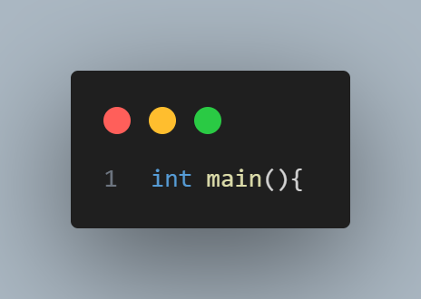

# C++ <a name="c++"></a>
¡Hola a todos los jóvenes programadores curiosos!

Hoy vamos a adentrarnos en un mundo fascinante: ¡la programación en C++! ¿Alguna vez te preguntaste cómo las computadoras entienden lo que les decimos? ¡Es todo gracias al código de máquina, que está formado solo por ceros y unos! Pero, ¿cómo logramos hablar con las computadoras de manera más fácil?

Existen diferentes "idiomas" que usamos para comunicarnos con las computadoras, como Java, Python, JavaScript y otros. Estos se llaman lenguajes modernos. Pero también hay otros, como los lenguajes ensambladores, que son como lenguajes más cercanos a la computadora. Aquí es donde entra en juego el C++, ¡que es súper emocionante!


Antes de comenzar este viaje, necesitamos prepararnos y entender qué es C++ y los lenguajes de alto y bajo nivel.

## lenguajes de alto y bajo nivel

Los lenguajes de programación son una forma de comunicarse con las computadoras, que son máquinas capaces de realizar operaciones lógicas y matemáticas a gran velocidad. Sin embargo, las computadoras no entienden el lenguaje humano, sino que solo pueden procesar instrucciones binarias, es decir, secuencias de ceros y unos que representan datos y comandos. Estas instrucciones binarias se conocen como lenguaje de máquina, y son el nivel más bajo de programación que existe.

Pero escribir programas en lenguaje de máquina es muy difícil y tedioso, ya que requiere conocer el funcionamiento interno de la computadora, y escribir largas cadenas de bits que son difíciles de leer y depurar. Por eso, los programadores han creado otros lenguajes de programación más fáciles de usar y entender, que se conocen como lenguajes de alto nivel. Estos lenguajes utilizan palabras, símbolos y estructuras que se parecen más al lenguaje humano, y que permiten expresar algoritmos y soluciones de forma más clara y concisa. Algunos ejemplos de lenguajes de alto nivel son Python, Java, Ruby, JavaScript, etc.

Sin embargo, los lenguajes de alto nivel no se pueden ejecutar directamente por la computadora, sino que tienen que ser traducidos al lenguaje de máquina. Esto se puede hacer de dos formas: mediante un compilador o mediante un intérprete. Un compilador es un programa que convierte todo el código fuente de un lenguaje de alto nivel en un archivo ejecutable de lenguaje de máquina, que se puede ejecutar en la computadora. Un intérprete es un programa que lee y ejecuta el código fuente de un lenguaje de alto nivel línea por línea, sin generar un archivo ejecutable. Cada forma tiene sus ventajas y desventajas, pero en general, los programas compilados suelen ser más rápidos y eficientes, mientras que los programas interpretados suelen ser más flexibles y portables.

Entre los lenguajes de alto nivel y el lenguaje de máquina, hay otro nivel intermedio de programación, que se conoce como lenguaje de bajo nivel. Estos lenguajes son más cercanos al hardware que los lenguajes de alto nivel, pero más fáciles de usar que el lenguaje de máquina. Estos lenguajes utilizan instrucciones que se corresponden con las operaciones del procesador, y que se pueden representar mediante mnemónicos, que son abreviaturas de palabras clave. Estas instrucciones se conocen como lenguaje ensamblador, y se pueden traducir al lenguaje de máquina mediante un programa llamado ensamblador. Algunos ejemplos de lenguajes de bajo nivel son C, C++, Fortran, etc.

Los lenguajes de bajo nivel tienen la ventaja de que permiten un mayor control y rendimiento sobre el sistema, pero también tienen la desventaja de que requieren un mayor conocimiento y responsabilidad sobre los recursos y las operaciones del hardware, como la memoria, los registros, los puertos, los dispositivos de entrada y salida, etc. Además, los lenguajes de bajo nivel suelen ser menos portables y más dependientes de la arquitectura y el compilador de la máquina.


En este curso, nos centraremos en uno de los lenguajes de bajo nivel más populares y poderosos que existen: C++. C++ es un lenguaje de programación que se basa en el lenguaje C, pero que añade algunas características que lo hacen más versátil y expresivo, como la programación orientada a objetos, la sobrecarga de operadores, las plantillas, las excepciones, etc. C++ también permite al programador elegir el nivel de abstracción que desea utilizar, desde el más bajo, que es casi equivalente al lenguaje ensamblador, hasta el más alto, que es similar a otros lenguajes de alto nivel. Esto hace que C++ sea un lenguaje multiparadigma, que se adapta a diferentes tipos de problemas y soluciones.


## **¿Qué es C++?**<a name="que-es-c++"></a>
C++ es un lenguaje de programación poderoso y extremadamente versátil. ¿Sabías que muchos videojuegos geniales como Minecraft o programas populares como Photoshop están escritos en C++? ¡Es realmente increíble cómo este lenguaje puede dar vida a cosas tan asombrosas!

C++ es conocido por su capacidad para mezclar la programación orientada a objetos con la programación más tradicional. Fue creado como una extensión del lenguaje de programación C en la década de 1980 y ha crecido para convertirse en uno de los lenguajes más utilizados en la programación de sistemas, videojuegos y aplicaciones.

**El Camino de C++**
Piensa en C++ como una caja de herramientas gigante. Puedes usarla para construir casi cualquier cosa: desde juegos épicos hasta programas que resuelven problemas matemáticos complejos. Su versatilidad lo hace súper emocionante.

Al igual que los superhéroes tienen diferentes habilidades, C++ puede manejar muchos desafíos informáticos. Puede hacer que las computadoras piensen, creen y solucionen problemas de manera rápida y eficiente.


**¿Por qué Aprender C++?**
Te estarás preguntando, ¿por qué deberías aprender C++? ¡Aquí hay algunas razones emocionantes!

- Poder y Velocidad: C++ está cerca del corazón de las computadoras, lo que lo hace rápido y eficiente para resolver problemas complejos.
- Flexibilidad: Puedes usar C++ para construir casi cualquier cosa: desde aplicaciones de teléfonos móviles hasta sistemas operativos.
- Desafíos emocionantes: Si te gustan los desafíos y resolver problemas intrigantes, C++ te ofrecerá un montón de diversión.
- ¡El Futuro Es Tuyo!: Grandes compañías como Microsoft, Amazon y Sony buscan desarrolladores de C++ para crear nuevos y emocionantes proyectos.


## **Variables** <a name="variables"></a>

Imagina una caja mágica que puede guardar información. Esa caja es una variable. En el mundo de la programación, las variables son como cajitas donde podemos guardar números, palabras o información importante para usarla más tarde.

En C++, una variable tiene un nombre y un valor asociado. Por ejemplo, si queremos guardar la edad de alguien:

<!-- ```cpp
int edad = 12;
``` -->


Aquí, "edad" es el nombre de la variable y "12" es el valor que está almacenando.

**Reglas para Crear Variables**

Hay algunas reglas para nombrar variables en C++. Debes recordar que:

- Los nombres de las variables pueden tener letras o números, y a veces el guion bajo (_), pero no es recomendable comenzar con un número.
- ¡Atención! Las variables no pueden comenzar con mayúsculas.

**Constantes: Valores que no Cambian**

Ahora, imagina una caja especial que tiene un valor que nunca cambia. Esa es una constante. En C++, usamos la palabra reservada "const" para definir constantes:

<!-- ```cpp
const int VALOR_CONSTANTE = 100;
``` -->


Aquí, "VALOR_CONSTANTE" es una constante y no podemos cambiar su valor más adelante en el programa.

**Declaración estática de variables**

La declaración estática de variables se hace mediante la especificación del tipo de dato y el nombre de la variable, opcionalmente seguido de un valor inicial. Por ejemplo:

<!-- ```cpp
int x; // declara una variable de tipo entero llamada x, sin asignarle un valor
char c = 'a'; // declara una variable de tipo carácter llamada c, y le asigna el valor 'a'
``` -->


La declaración estática de variables tiene la ventaja de que es más rápida y eficiente, ya que el compilador sabe de antemano cuánta memoria necesita reservar y dónde ubicarla. Además, el compilador puede hacer comprobaciones de tipos y errores en tiempo de compilación, lo que evita posibles fallos en tiempo de ejecución. Sin embargo, la declaración estática de variables también tiene la desventaja de que es más rígida y limitada, ya que el tamaño y la ubicación de la memoria de la variable no se pueden cambiar una vez que se ha declarado. Esto puede provocar problemas de desperdicio o escasez de memoria, si el tamaño de la variable es mayor o menor que el necesario.

**Declaración dinámica de variables**

La declaración dinámica de variables se hace mediante el uso de los operadores `new` y `delete`, que permiten asignar y liberar memoria en tiempo de ejecución. El operador `new` reserva una cantidad de memoria suficiente para almacenar un valor de un tipo determinado, y devuelve un puntero a esa zona de memoria. El operador `delete` libera la memoria que ha sido asignada previamente por el operador `new`, y evita que el puntero apunte a una zona de memoria inválida. Por ejemplo:

<!-- ```cpp
int* p = new int; // declara un puntero a entero llamado p, y le asigna una zona de memoria para un entero
*p = 10; // accede y modifica el valor de la zona de memoria apuntada por p
delete p; // libera la memoria asignada por el operador new, y evita que p apunte a una zona de memoria inválida
``` -->


La declaración dinámica de variables tiene la ventaja de que es más flexible y adaptable, ya que el tamaño y la ubicación de la memoria de la variable se pueden cambiar según las necesidades del programa. Esto permite crear estructuras de datos dinámicas, como arreglos, listas, árboles, etc. Sin embargo, la declaración dinámica de variables también tiene la desventaja de que es más lenta y compleja, ya que el programador es responsable de asignar y liberar la memoria correctamente, y de evitar posibles errores, como fugas de memoria, corrupción de datos, o acceso a zonas de memoria no válidas.

## **Tipos de Datos en C++** <a name="tipos-datos"></a>

En C++, tenemos diferentes tipos de datos para diferentes tipos de información que queremos almacenar. Los más comunes son:

- **int**: Para números enteros (ejemplo: 10, -5, 1000).
- **float y double**: Para números decimales o flotantes (ejemplo: 3.14, 0.5, 9.99).
- **char**: Para caracteres individuales (ejemplo: 'a', 'B', '$').
- **bool**: Para valores de verdadero (true) o falso (false).

Cada tipo de dato tiene un tamaño específico que determina cuánta información puede almacenar.


- Tipos enteros: son los que representan números enteros, es decir, sin parte decimal. Se pueden dividir en dos categorías: con signo y sin signo. Los tipos enteros con signo pueden representar números positivos y negativos, mientras que los tipos enteros sin signo solo pueden representar números positivos. Los tipos enteros más comunes son `char`, `short`, `int`, `long` y `long long`.
- Tipos reales: son los que representan números reales, es decir, con parte decimal. Se pueden dividir en dos categorías: de precisión simple y de precisión doble. Los tipos reales de precisión simple pueden representar números con menos decimales, pero ocupan menos memoria. Los tipos reales de precisión doble pueden representar números con más decimales, pero ocupan más memoria. Los tipos reales más comunes son `float` y `double`.
- Tipo carácter: es el que representa un carácter, es decir, un símbolo alfanumérico o especial. El tipo carácter más común es `char`, que puede representar un carácter del conjunto ASCII, que tiene 128 símbolos. También existe el tipo `wchar_t`, que puede representar un carácter del conjunto Unicode, que tiene más de 100000 símbolos.
- Tipo booleano: es el que representa un valor lógico, es decir, verdadero o falso. El tipo booleano más común es `bool`, que puede representar los valores `true` o `false`.

En la siguiente tabla se muestra el tamaño y el rango de los tipos de datos básicos en C++, asumiendo que se usa una arquitectura de 32 bits y un compilador estándar:

| Tipo de dato | Tamaño (bytes) | Rango |
|--------------|----------------|-------|
| char         | 1              | -128 a 127 |
| unsigned char | 1             | 0 a 255 |
| short        | 2              | -32768 a 32767 |
| unsigned short | 2            | 0 a 65535 |
| int          | 4              | -2147483648 a 2147483647 |
| unsigned int | 4              | 0 a 4294967295 |
| long         | 4              | -2147483648 a 2147483647 |
| unsigned long | 4             | 0 a 4294967295 |
| long long    | 8              | -9223372036854775808 a 9223372036854775807 |
| unsigned long long | 8        | 0 a 18446744073709551615 |
| float        | 4              | ±1.17549435e-38 a ±3.40282347e+38 |
| double       | 8              | ±2.2250738585072014e-308 a ±1.7976931348623157e+308 |
| wchar_t      | 2 o 4          | depende del compilador |
| bool         | 1              | true o false |


#### ***Tipos string***

Tipos de cadena de caracteres En C++, no existe un tipo de dato especial para guardar cadenas de caracteres, como palabras o frases. Lo que sí existe son los tipos `char` y `wchar_t`, que sirven para guardar un solo carácter, como una letra o un signo. Para guardar una cadena de caracteres, hay que usar un arreglo de estos tipos, y poner un valor especial al final para indicar dónde termina la cadena (por ejemplo, ‘\0’ en ASCII). A este tipo de cadenas se les llama cadenas de estilo C, y son las que se usaban en el lenguaje C original. El problema de las cadenas de estilo C es que son difíciles de manejar y requieren usar funciones externas para hacer operaciones con ellas. Por eso, en C++ moderno, se recomienda usar los tipos de la biblioteca estándar `std::string` (para cadenas de caracteres de tipo char de 8 bits) o `std::wstring` (para cadenas de caracteres de tipo `wchar_t` de 16 bits). Estos tipos son como contenedores que guardan y manipulan cadenas de caracteres de forma más fácil y segura, y forman parte de las bibliotecas que vienen con cualquier compilador de C++ compatible. Para usar estos tipos, hay que incluir la directiva `#include <string>` en el programa. (También existe el tipo CString, que se usa con las bibliotecas MFC o ATL, pero no es parte del estándar de C++). El uso de arreglos de caracteres terminados en NULL (las cadenas de estilo C mencionadas antes) no se aconseja en C++ actual.


un ejemplo claro de esto sería el siguiente:

<!-- ```cpp
#include <string> // se necesita esta directiva para usar los tipos string

// declaración estática de variables de tipo string
std::string nombre = "Juan"; // se declara una variable de tipo string llamada nombre, y se le asigna el valor "Juan"
std::wstring saludo = L"Hola"; // se declara una variable de tipo wstring llamada saludo, y se le asigna el valor "Hola"

// declaración dinámica de variables de tipo string
std::string* mensaje = new std::string("Bienvenido"); // se declara un puntero a string llamado mensaje, y se le asigna una zona de memoria para un string con el valor "Bienvenido"
std::wstring* despedida = new std::wstring(L"Adiós"); // se declara un puntero a wstring llamado despedida, y se le asigna una zona de memoria para un wstring con el valor "Adiós"

// uso de variables de tipo string
std::cout << nombre << std::endl; // se imprime el valor de la variable nombre en la salida estándar
std::wcout << saludo << std::endl; // se imprime el valor de la variable saludo en la salida estándar
std::cout << *mensaje << std::endl; // se imprime el valor de la zona de memoria apuntada por el puntero mensaje en la salida estándar
std::wcout << *despedida << std::endl; // se imprime el valor de la zona de memoria apuntada por el puntero despedida en la salida estándar

// liberación de la memoria asignada dinámicamente
delete mensaje; // se libera la memoria asignada por el operador new para el puntero mensaje
delete despedida; // se libera la memoria asignada por el operador new para el puntero despedida

``` -->


Ahora veremos cómo escribir y ejecutar nuestro primer programa en C++, que consiste en mostrar el mensaje "Hola mundo :D" en la pantalla. Para ello, necesitamos un editor de texto, donde escribiremos el código fuente del programa, y un compilador, que traducirá el código fuente a un archivo ejecutable que se puede ejecutar en la computadora. Hay muchos editores de texto y compiladores disponibles, pero en este caso, usaremos el editor dev c++.

El código fuente de nuestro primer programa en C++ es el siguiente:

```cpp
//Primer programa en c++

using namespace std;

#include<iostream>

int main(){

    cout<<"Hola mundo :D"<<endl;

    cout<<"Hola mundo :D\n";

    return 0;
}
```

Veamos qué significa cada línea de este código:


- La primera línea es un comentario, que sirve para añadir información o explicaciones al código, pero que no afecta al funcionamiento del programa. Los comentarios se pueden escribir de dos formas: con dos barras (//) para comentarios de una sola línea, o con una barra y un asterisco (/*) para comentarios de varias líneas, que se cierran con un asterisco y una barra (\*/). En este caso, el comentario indica el propósito del programa.
  
    
    
- La segunda línea es una directiva de preprocesador, que sirve para dar instrucciones al compilador antes de traducir el código fuente. Las directivas de preprocesador se escriben con una almohadilla (#) al principio. En este caso, la directiva using namespace std le dice al compilador que use el espacio de nombres estándar, que es donde se encuentran las funciones y los tipos de la biblioteca estándar de C++, como cout, string, vector, etc. Esto nos evita tener que escribir el nombre completo de cada función o tipo, como std::cout o std::string, cada vez que los usemos.

    
    
- La tercera línea es otra directiva de preprocesador, que sirve para incluir el contenido de otro archivo en el código fuente. En este caso, la directiva `#include<iostream>` incluye el contenido del archivo iostream, que es el que contiene las funciones y los tipos para hacer operaciones de entrada y salida, como leer datos del teclado o mostrar datos en la pantalla. El nombre del archivo se escribe entre paréntesis angulares (< >) si se trata de un archivo de la biblioteca estándar, o entre comillas dobles (" ") si se trata de un archivo propio o de terceros.

    

- La quinta línea es la definición de la función principal del programa, que se llama main. La función main es la que se ejecuta al iniciar el programa, y es la que contiene las instrucciones que se quieren realizar. La función main se escribe con la palabra reservada int, que indica el tipo de dato que devuelve la función, seguida del nombre de la función, y unos paréntesis que pueden contener parámetros, que son valores que se le pasan a la función. En este caso, la función main no tiene parámetros, por lo que los paréntesis están vacíos. Después de los paréntesis, se abre una llave ({), que indica el inicio del cuerpo de la función, donde se escriben las instrucciones.

    

- La sexta línea es una instrucción, que sirve para realizar una acción o una operación en el programa. Las instrucciones se escriben con una o más expresiones, que son combinaciones de valores, variables, operadores y funciones, que producen un resultado. Las instrucciones se terminan con un punto y coma (\;), que indica el final de la instrucción. En este caso, la instrucción es `cout<<"Hola mundo :D"<<endl;`, que sirve para mostrar el mensaje "Hola mundo :D" en la pantalla, seguido de un salto de línea. La expresión `cout` es un objeto de la clase *ostream*, que representa el flujo de salida estándar, es decir, la pantalla. El operador `<<` es un operador de inserción, que sirve para enviar un valor al flujo de salida. El valor que se envía es "Hola mundo :D", que es una cadena de caracteres, es decir, una secuencia de caracteres entre comillas dobles. El valor `endl` es otro objeto de la clase *ostream*, que representa el fin de línea, es decir, un carácter especial que hace que el cursor se mueva a la siguiente línea. Al usar el operador `<<` con `cout` y `endl`, se consigue mostrar el mensaje en la pantalla y pasar a la siguiente línea.
- La séptima línea es otra instrucción, que sirve para mostrar el mismo mensaje que la anterior, pero con una forma diferente. En este caso, la instrucción es `cout<<"Hola mundo :D\n";`, que también usa el objeto cout y el operador `<<`, pero en lugar de usar el objeto endl, usa el carácter especial `\n`, que también representa el fin de línea. El carácter `\n` se escribe dentro de la cadena de caracteres, precedido de una barra invertida (\\), que indica que se trata de un carácter de escape, es decir, un carácter que tiene un significado especial y que no se muestra literalmente. Hay otros caracteres de escape, como `\t` (tabulación), `\r` (retorno de carro), `\` (barra invertida), \" (comillas dobles), etc. Al usar el carácter `\n` con `cout`, se consigue el mismo efecto que con `endl`, pero con menos caracteres.

    

- La octava línea es la última instrucción de la función main, que sirve para devolver un valor al finalizar el programa. En este caso, la instrucción es `return 0;`, que devuelve el valor 0, que indica que el programa ha terminado correctamente. La palabra reservada `return` indica que se quiere devolver un valor, y el valor que se devuelve debe ser del mismo tipo que el que se ha especificado al definir la función. En este caso, la función `main` tiene el tipo `int`, que es un tipo entero, por lo que el valor que se devuelve debe ser un número entero. El valor 0 se usa por convención para indicar que el programa ha terminado sin errores, pero se puede usar cualquier otro valor entero para indicar otros tipos de finalización, como errores o excepciones.
- La novena línea es una llave de cierre (}), que indica el final del cuerpo de la función main, y por tanto, el final del programa.

Este es el código fuente de nuestro primer programa en C++, que muestra el mensaje "Hola mundo :D" en la pantalla. Para ejecutarlo, hay que guardar el código fuente en un archivo con extensión .cpp, como por ejemplo, hola_mundo.cpp, y luego usar el compilador dev c++ damos clic en execute y luego en compile & run.


Este comando le dice al sistema operativo que ejecute el archivo hola_mundo.exe, y que muestre el resultado en la pantalla. Si todo ha ido bien, se debería ver el siguiente resultado:

<!-- ```cmd
Hola mundo :D
Hola mundo :D
``` -->


Este es el resultado de nuestro primer programa en C++, que muestra el mensaje "Hola mundo :D" en la pantalla, dos veces, una con endl y otra con \n. Con esto, hemos aprendido los conceptos básicos de C++.

## Variables en C++: ¿Qué son, cómo se usan y cómo se gestionan?

Las variables son uno de los conceptos más fundamentales de la programación, y también uno de los más útiles. Una variable es un espacio de memoria que se reserva para almacenar un valor, que puede cambiar durante la ejecución del programa. Las variables nos permiten guardar y manipular datos, como números, caracteres, cadenas, booleanos, etc. Las variables también tienen un nombre, que es la forma de identificarlas y acceder a ellas en el código.

En C++, las variables se pueden declarar de dos formas: estática o dinámica. La declaración estática significa que el tamaño y la ubicación de la memoria de la variable se determinan en tiempo de compilación, y no se pueden modificar en tiempo de ejecución. La declaración dinámica significa que el tamaño y la ubicación de la memoria de la variable se determinan en tiempo de ejecución, y se pueden modificar según las necesidades del programa. Veamos las diferencias y las ventajas de cada forma.

## Declaración estática de variables

La declaración estática de variables se hace mediante la especificación del tipo de dato y el nombre de la variable, opcionalmente seguido de un valor inicial. Por ejemplo:

```cpp
int x; // declara una variable de tipo entero llamada x, sin asignarle un valor
char c = 'a'; // declara una variable de tipo carácter llamada c, y le asigna el valor 'a'
```

La declaración estática de variables tiene la ventaja de que es más rápida y eficiente, ya que el compilador sabe de antemano cuánta memoria necesita reservar y dónde ubicarla. Además, el compilador puede hacer comprobaciones de tipos y errores en tiempo de compilación, lo que evita posibles fallos en tiempo de ejecución. Sin embargo, la declaración estática de variables también tiene la desventaja de que es más rígida y limitada, ya que el tamaño y la ubicación de la memoria de la variable no se pueden cambiar una vez que se ha declarado. Esto puede provocar problemas de desperdicio o escasez de memoria, si el tamaño de la variable es mayor o menor que el necesario.

## Declaración dinámica de variables

La declaración dinámica de variables se hace mediante el uso de los operadores `new` y `delete`, que permiten asignar y liberar memoria en tiempo de ejecución. El operador `new` reserva una cantidad de memoria suficiente para almacenar un valor de un tipo determinado, y devuelve un puntero a esa zona de memoria. El operador `delete` libera la memoria que ha sido asignada previamente por el operador `new`, y evita que el puntero apunte a una zona de memoria inválida. Por ejemplo:

```cpp
int* p = new int; // declara un puntero a entero llamado p, y le asigna una zona de memoria para un entero
*p = 10; // accede y modifica el valor de la zona de memoria apuntada por p
delete p; // libera la memoria asignada por el operador new, y evita que p apunte a una zona de memoria inválida
```

La declaración dinámica de variables tiene la ventaja de que es más flexible y adaptable, ya que el tamaño y la ubicación de la memoria de la variable se pueden cambiar según las necesidades del programa. Esto permite crear estructuras de datos dinámicas, como arreglos, listas, árboles, etc. Sin embargo, la declaración dinámica de variables también tiene la desventaja de que es más lenta y compleja, ya que el programador es responsable de asignar y liberar la memoria correctamente, y de evitar posibles errores, como fugas de memoria, corrupción de datos, o acceso a zonas de memoria no válidas.

## Tipos de datos y tamaño de la memoria

Los tipos de datos son una forma de clasificar y representar la información que se almacena y se procesa en la computadora. Los tipos de datos básicos son los números enteros, los números reales, los caracteres, los booleanos, etc. Cada tipo de dato tiene un tamaño y un rango determinados, que dependen de la arquitectura y el compilador de la máquina. El tamaño de un tipo de dato indica cuántos bytes ocupa en la memoria, y el rango indica los valores mínimos y máximos que puede representar. Por ejemplo, un número entero puede ocupar 4 bytes (32 bits) y tener un rango de -2^31 a 2^31-1.

Los tipos de datos son importantes porque determinan cómo se almacena y se manipula la información en la memoria de la computadora. El tamaño de un tipo de dato afecta al espacio de memoria que se necesita reservar para una variable, y al rendimiento del programa. El rango de un tipo de dato afecta a la precisión y la exactitud de la información que se puede representar y procesar. Por eso, es importante elegir el tipo de dato adecuado para cada variable, según el tipo y el tamaño de la información que se quiere almacenar y manipular.

En C++, los tipos de datos básicos se pueden clasificar en los siguientes grupos:

- Tipos enteros: son los que representan números enteros, es decir, sin parte decimal. Se pueden dividir en dos categorías: con signo y sin signo. Los tipos enteros con signo pueden representar números positivos y negativos, mientras que los tipos enteros sin signo solo pueden representar números positivos. Los tipos enteros más comunes son `char`, `short`, `int`, `long` y `long long`.
- Tipos reales: son los que representan números reales, es decir, con parte decimal. Se pueden dividir en dos categorías: de precisión simple y de precisión doble. Los tipos reales de precisión simple pueden representar números con menos decimales, pero ocupan menos memoria. Los tipos reales de precisión doble pueden representar números con más decimales, pero ocupan más memoria. Los tipos reales más comunes son `float` y `double`.
- Tipo carácter: es el que representa un carácter, es decir, un símbolo alfanumérico o especial. El tipo carácter más común es `char`, que puede representar un carácter del conjunto ASCII, que tiene 128 símbolos. También existe el tipo `wchar_t`, que puede representar un carácter del conjunto Unicode, que tiene más de 100000 símbolos.
- Tipo booleano: es el que representa un valor lógico, es decir, verdadero o falso. El tipo booleano más común es `bool`, que puede representar los valores `true` o `false`.

En la siguiente tabla se muestra el tamaño y el rango de los tipos de datos básicos en C++, asumiendo que se usa una arquitectura de 32 bits y un compilador estándar:

| Tipo de dato | Tamaño (bytes) | Rango |
|--------------|----------------|-------|
| char         | 1              | -128 a 127 |
| unsigned char | 1             | 0 a 255 |
| short        | 2              | -32768 a 32767 |
| unsigned short | 2            | 0 a 65535 |
| int          | 4              | -2147483648 a 2147483647 |
| unsigned int | 4              | 0 a 4294967295 |
| long         | 4              | -2147483648 a 2147483647 |
| unsigned long | 4             | 0 a 4294967295 |
| long long    | 8              | -9223372036854775808 a 9223372036854775807 |
| unsigned long long | 8        | 0 a 18446744073709551615 |
| float        | 4              | ±1.17549435e-38 a ±3.40282347e+38 |
| double       | 8              | ±2.2250738585072014e-308 a ±1.7976931348623157e+308 |
| wchar_t      | 2 o 4          | depende del compilador |
| bool         | 1              | true o false |


## ¿Qué son las variables?

Una variable es un espacio de memoria que tiene un nombre y un tipo, y que puede almacenar un valor. El nombre de la variable nos permite identificarla y acceder a ella, y el tipo de la variable nos indica qué clase de datos puede almacenar y cómo se interpretan. Por ejemplo, una variable de tipo `int` puede almacenar números enteros, y una variable de tipo `string` puede almacenar cadenas de texto.

Para declarar una variable en C++, debemos escribir el tipo de la variable seguido del nombre de la variable, y opcionalmente podemos asignarle un valor inicial. Por ejemplo:

```c++
int edad = 21; // declara una variable de tipo int llamada edad y le asigna el valor 21
string nombre = "Juan"; // declara una variable de tipo string llamada nombre y le asigna el valor "Juan"
```

Para usar una variable en nuestro código, podemos referirnos a ella por su nombre. Por ejemplo, podemos imprimir el valor de una variable en la consola usando la función `cout`:

```c++
cout << "Mi nombre es " << nombre << " y tengo " << edad << " años." << endl;
// imprime en la consola: Mi nombre es Juan y tengo 21 años.
```

También podemos modificar el valor de una variable usando el operador de asignación `=`:

```c++
edad = 22; // cambia el valor de la variable edad a 22
nombre = "Ana"; // cambia el valor de la variable nombre a "Ana"
```

## ¿Qué son las constantes?

Una constante es un tipo especial de variable que no puede cambiar su valor una vez que se le asigna. Esto nos permite definir valores fijos que no queremos que se modifiquen durante la ejecución del programa. Por ejemplo, podemos definir una constante para representar el número pi, que siempre tiene el mismo valor.

Para declarar una constante en C++, debemos usar la palabra clave `const` antes del tipo de la variable, y debemos asignarle un valor inicial. Por ejemplo:

```c++
const double pi = 3.14159; // declara una constante de tipo double llamada pi y le asigna el valor 3.14159
```

Para usar una constante en nuestro código, podemos referirnos a ella por su nombre, igual que con una variable. Por ejemplo, podemos calcular el área de un círculo usando la fórmula `area = pi * radio * radio`:

```c++
double radio = 5.0; // declara una variable de tipo double llamada radio y le asigna el valor 5.0
double area = pi * radio * radio; // declara una variable de tipo double llamada area y le asigna el valor del área del círculo
cout << "El área del círculo es " << area << endl;
// imprime en la consola: El área del círculo es 78.5398
```

Sin embargo, no podemos modificar el valor de una constante usando el operador de asignación `=`, ya que esto generaría un error de compilación. Por ejemplo, si intentamos hacer lo siguiente:

```c++
pi = 3.14; // intenta cambiar el valor de la constante pi a 3.14
```

Obtendríamos el siguiente mensaje de error:

```c++
error: assignment of read-only variable 'pi'
```

## ¿Qué son los operadores en C++?

En C++, un operador es simplemente un signo para una operación. Puede referirse a uno, pero sobre todo a varios operandos. Como resultado, se obtiene un nuevo valor en la mayoría de los casos. Los operadores son fundamentales para la creación de programas eficientes y efectivos.

## Operadores aritméticos

Los operadores aritméticos básicos son:

- **+**: suma
- **-**: resta
- **\***: multiplicación
- **/**: división
- **%**: módulo (el resto de una división)

Aquí hay algunos ejemplos de cómo se utilizan los operadores aritméticos:

```c++
int x = 5;
int y = 3;
int z = x + y; // z es igual a 8
int w = x - y; // w es igual a 2
int a = x * y; // a es igual a 15
int b = x / y; // b es igual a 1
int c = x % y; // c es igual a 2
```

## Operadores de asignación

Los operadores de asignación básicos son:

- **=**: asignación simple
- **+=**: asignación combinada
- **-=**: asignación combinada
- **\*=**: asignación combinada
- **/=**: asignación combinada
- **%=**: asignación combinada

Aquí hay algunos ejemplos de cómo se utilizan los operadores de asignación:

```c++
int x = 5;
x += 3; // x es igual a 8
x -= 3; // x es igual a 5
x *= 3; // x es igual a 15
x /= 3; // x es igual a 5
x %= 3; // x es igual a 2
```

## Operadores de comparación

Los operadores de comparación básicos son:

- **==**: igualdad
- **!=**: desigualdad
- **>**: mayor que
- **<**: menor que
- **>=**: mayor o igual que
- **<=**: menor o igual que

Aquí hay algunos ejemplos de cómo se utilizan los operadores de comparación:

```c++
int x = 5;
int y = 3;
bool a = x == y; // a es igual a false
bool b = x != y; // b es igual a true
bool c = x > y; // c es igual a true
bool d = x < y; // d es igual a false
bool e = x >= y; // e es igual a true
bool f = x <= y; // f es igual a false
```

## Operadores lógicos

Los operadores lógicos básicos son:

- **&&**: AND lógico
- **||**: OR lógico
- **!**: NOT lógico

Aquí hay algunos ejemplos de cómo se utilizan los operadores lógicos:

```c++
int x = 5;
int y = 3;
bool a = (x > 3) && (y < 5); // a es igual a true
bool b = (x > 3) || (y > 5); // b es igual a true
bool c = !(x > 3); // c es igual a false
```

## ¿Qué son los arrays?

Un array es una colección de valores del mismo tipo que se almacenan de forma contigua en la memoria. Cada valor del array se llama elemento, y cada elemento tiene una posición o índice que indica su lugar en el array. El primer elemento del array tiene el índice 0, el segundo tiene el índice 1, y así sucesivamente. El último elemento del array tiene el índice igual al tamaño del array menos uno.

Para declarar un array en C++, debemos escribir el tipo de los elementos seguido del nombre del array y entre corchetes el tamaño del array. Por ejemplo:

```c++
int numeros[5]; // declara un array de tipo int llamado numeros y de tamaño 5
```

Para inicializar un array en C++, podemos asignarle los valores de los elementos entre llaves y separados por comas. Por ejemplo:

```c++
int numeros[5] = {10, 20, 30, 40, 50}; // declara e inicializa un array de tipo int llamado numeros y de tamaño 5 con los valores 10, 20, 30, 40 y 50
```

También podemos omitir el tamaño del array y dejar que el compilador lo deduzca a partir del número de elementos que le asignamos. Por ejemplo:

```c++
int numeros[] = {10, 20, 30, 40, 50}; // declara e inicializa un array de tipo int llamado numeros y de tamaño 5 con los valores 10, 20, 30, 40 y 50
```

## ¿Cómo acceder y modificar los elementos de un array?

Para acceder a un elemento de un array, debemos usar el nombre del array seguido del índice del elemento entre corchetes. Por ejemplo, para acceder al primer elemento del array numeros, podemos escribir:

```c++
cout << numeros[0] << endl; // imprime en la consola el valor 10
```

Para modificar el valor de un elemento de un array, debemos usar el operador de asignación `=` con el nombre del array seguido del índice del elemento entre corchetes. Por ejemplo, para cambiar el valor del primer elemento del array numeros a 100, podemos escribir:

```c++
numeros[0] = 100; // cambia el valor del primer elemento del array numeros a 100
```

## ¿Cómo usar los métodos y funciones para trabajar con arrays?

C++ nos ofrece algunos métodos y funciones que nos facilitan el trabajo con arrays. Algunos de los más útiles son:

- El método `size()` nos devuelve el tamaño de un array. Por ejemplo:

```c++
cout << numeros.size() << endl; // imprime en la consola el valor 5
```

- La función `sort()` nos permite ordenar los elementos de un array de forma ascendente o descendente. Para usar esta función, debemos incluir la librería `<algorithm>`. Por ejemplo:

```c++
#include <algorithm> // incluye la librería <algorithm>
sort(numeros, numeros + numeros.size()); // ordena los elementos del array numeros de forma ascendente
cout << numeros[0] << " " << numeros[4] << endl; // imprime en la consola los valores 10 y 100
sort(numeros, numeros + numeros.size(), greater<int>()); // ordena los elementos del array numeros de forma descendente
cout << numeros[0] << " " << numeros[4] << endl; // imprime en la consola los valores 100 y 10
```

- La función `reverse()` nos permite invertir el orden de los elementos de un array. Para usar esta función, debemos incluir la librería `<algorithm>`. Por ejemplo:

```c++
#include <algorithm> // incluye la librería <algorithm>
reverse(numeros, numeros + numeros.size()); // invierte el orden de los elementos del array numeros
cout << numeros[0] << " " << numeros[4] << endl; // imprime en la consola los valores 50 y 100
```

- La función `fill()` nos permite asignar el mismo valor a todos los elementos de un array. Para usar esta función, debemos incluir la librería `<algorithm>`. Por ejemplo:

```c++
#include <algorithm> // incluye la librería <algorithm>
fill(numeros, numeros + numeros.size(), 0); // asigna el valor 0 a todos los elementos del array numeros
cout << numeros[0] << " " << numeros[4] << endl; // imprime en la consola los valores 0 y 0
```

## Estructuras de control en C++

Las estructuras de control son elementos del lenguaje de programación que nos permiten modificar el flujo de ejecución de un programa, es decir, el orden en el que se ejecutan las instrucciones.

## Estructura secuencial

La estructura secuencial es la más simple y básica de todas. Consiste en una serie de instrucciones que se ejecutan una tras otra, en el orden en el que aparecen en el código. Cada instrucción debe terminar con un punto y coma (;) para indicar el final de la misma. Por ejemplo:

```c++
#include <iostream>
using namespace std;

int main() {
  cout << "Hola, mundo!" << endl; // Imprime un mensaje en la pantalla
  int x = 5; // Declara una variable entera y le asigna un valor
  x = x + 2; // Modifica el valor de la variable sumándole 2
  cout << "El valor de x es " << x << endl; // Imprime el valor de la variable
  return 0; // Termina la ejecución del programa
}
```

En este ejemplo, el programa ejecuta las instrucciones de forma secuencial, desde la primera hasta la última. El resultado sería:

```
Hola, mundo!
El valor de x es 7
```

## Estructura condicional

La estructura condicional nos permite elegir entre dos o más opciones en función del valor de una expresión lógica o booleana, que puede ser verdadera (true) o falsa (false). En C++, existen dos tipos de estructuras condicionales: la instrucción if y la instrucción switch.

### Instrucción if

La instrucción if nos permite ejecutar una o más instrucciones si se cumple una condición, y opcionalmente, ejecutar otras instrucciones si no se cumple. La sintaxis general es la siguiente:

```c++
if (condicion) {
  // Instrucciones a ejecutar si la condicion es verdadera
}
else {
  // Instrucciones a ejecutar si la condicion es falsa
}
```

La palabra clave else es opcional, y se puede omitir si no queremos hacer nada en caso de que la condición sea falsa. También se pueden omitir las llaves ({}) si solo hay una instrucción dentro del bloque, pero se recomienda usarlas para evitar confusiones. Por ejemplo:

```c++
#include <iostream>
using namespace std;

int main() {
  int edad;
  cout << "Introduce tu edad: ";
  cin >> edad; // Lee un valor entero desde el teclado
  if (edad >= 18) {
    cout << "Eres mayor de edad" << endl;
  }
  else {
    cout << "Eres menor de edad" << endl;
  }
  return 0;
}
```

En este ejemplo, el programa lee la edad del usuario y comprueba si es mayor o menor de 18 años, usando el operador relacional >= (mayor o igual que). El resultado dependerá del valor introducido por el usuario. Por ejemplo, si introduce 20, el resultado sería:

```
Introduce tu edad: 20
Eres mayor de edad
```

Si introduce 15, el resultado sería:

```
Introduce tu edad: 15
Eres menor de edad
```

La instrucción if se puede anidar dentro de otra instrucción if, para comprobar varias condiciones de forma jerárquica. Por ejemplo:

```c++
#include <iostream>
using namespace std;

int main() {
  int nota;
  cout << "Introduce tu calificación: ";
  cin >> nota; // Lee un valor entero desde el teclado
  if (nota >= 0 && nota <= 10) { // Comprueba que la nota sea válida, usando el operador lógico && (y)
    if (nota >= 5) { // Comprueba que la nota sea aprobado
      cout << "Has aprobado" << endl;
      if (nota == 10) { // Comprueba que la nota sea sobresaliente
        cout << "Bien hecho, tienes un 10" << endl;
      }
    }
    else { // Si la nota es menor que 5
      cout << "Has reprobado" << endl;
    }
  }
  else { // Si la nota no es válida
    cout << "Calificación incorrecta" << endl;
  }
  return 0;
}
```

En este ejemplo, el programa lee la nota del usuario y muestra un mensaje según el rango en el que se encuentre. El resultado dependerá del valor introducido por el usuario. Por ejemplo, si introduce 8, el resultado sería:

```
Introduce tu nota: 8
Has aprobado
```

Si introduce 10, el resultado sería:

```
Introduce tu nota: 10
Has aprobado
Bien hecho, tienes un 10
```

Si introduce 4, el resultado sería:

```
Introduce tu nota: 4
Has reprobado
```

Si introduce 11, el resultado sería:

```
Introduce tu nota: 11
Nota incorrecta
```

También se puede usar la palabra clave else if para simplificar la escritura de varios if anidados, cuando solo queremos ejecutar una opción entre varias. Por ejemplo:

```c++
#include <iostream>
using namespace std;

int main() {
  int dia;
  cout << "Introduce un número del 1 al 7: ";
  cin >> dia; // Lee un valor entero desde el teclado
  if (dia == 1) {
    cout << "Lunes" << endl;
  }
  else if (dia == 2) {
    cout << "Martes" << endl;
  }
  else if (dia == 3) {
    cout << "Miércoles" << endl;
  }
  else if (dia == 4) {
    cout << "Jueves" << endl;
  }
  else if (dia == 5) {
    cout << "Viernes" << endl;
  }
  else if (dia == 6) {
    cout << "Sábado" << endl;
  }
  else if (dia == 7) {
    cout << "Domingo" << endl;
  }
  else {
    cout << "Número incorrecto" << endl;
  }
  return 0;
}
```

En este ejemplo, el programa lee un número del 1 al 7 y muestra el nombre del día de la semana correspondiente, usando el operador de igualdad ==. El resultado dependerá del valor introducido por el usuario. Por ejemplo, si introduce 3, el resultado sería:

```
Introduce un número del 1 al 7: 3
Miércoles
```

Si introduce 8, el resultado sería:

```
Introduce un número del 1 al 7: 8
Número incorrecto
```

### Instrucción switch

La instrucción switch nos permite ejecutar una o más instrucciones entre varias opciones, en función del valor de una expresión entera o de tipo char. La sintaxis general es la siguiente:

```c++
switch (expresion) {
  case valor1:
    // Instrucciones a ejecutar si la expresion es igual a valor1
    break;
  case valor2:
    // Instrucciones a ejecutar si la expresion es igual a valor2
    break;
  ...
  default:
    // Instrucciones a ejecutar si la expresion no es igual a ninguno de los valores anteriores
    break;
}
```

La palabra clave case indica el valor que puede tomar la expresión para ejecutar el bloque de instrucciones correspondiente. La palabra clave break indica el final del bloque y hace que se salga de la instrucción switch. La palabra clave default es opcional, y se usa para indicar el bloque de instrucciones que se ejecuta si la expresión no coincide con ninguno de los valores anteriores. Por ejemplo:

```c++
#include <iostream>
using namespace std;

int main() {
  char letra;
  cout << "Introduce una letra: ";
  cin >> letra; // Lee un valor de tipo char desde el teclado
  switch (letra) {
    case 'a':
    case 'e':
    case 'i':
    case 'o':
    case 'u':
      cout << "Es una vocal" << endl;
      break;
    case 'b':
    case 'c':
    case 'd':
    case 'f':
    case 'g':
      cout << "Es una consonante" << endl;
      break;
    default:
      cout << "No es una letra" << endl;
      break;
  }
  return 0;
}
```

En este ejemplo, el programa lee una letra y muestra si es una vocal, una consonante o no es una letra, usando la instrucción switch. El resultado dependerá de la letra que ponga el usuario.

## Bucle while

El bucle while nos permite ejecutar un bloque de código de forma repetida mientras se cumpla una condición. Esto es muy útil cuando no sabemos de antemano cuántas veces queremos repetir el código, o cuando queremos que el código dependa de algún evento externo.

## Sintaxis del bucle while

La sintaxis del bucle while es la siguiente:

```cpp
while (condicion) {
  // bloque de código a ejecutar
}
```

La condición es una expresión lógica que puede ser verdadera o falsa. El bloque de código es el conjunto de sentencias que queremos ejecutar mientras la condición sea verdadera. El bloque de código puede tener una o más sentencias, y debe estar encerrado entre llaves.

El funcionamiento del bucle while es el siguiente:

- Se evalúa la condición. Si es verdadera, se ejecuta el bloque de código. Si es falsa, se termina el bucle y se continúa con el resto del programa.
- Después de ejecutar el bloque de código, se vuelve a evaluar la condición. Si sigue siendo verdadera, se repite el bloque de código. Si se ha vuelto falsa, se termina el bucle y se continúa con el resto del programa.
- Este proceso se repite hasta que la condición sea falsa.


### Ejemplo 1: Mostrar los números del 1 al 10

Supongamos que queremos mostrar los números del 1 al 10 en la pantalla. Podríamos usar 10 sentencias de impresión, una para cada número, pero eso sería muy tedioso y poco eficiente. Una forma mejor de hacerlo es usar un bucle while. Para ello, necesitamos una variable que actúe como contador, y que vaya incrementando su valor en cada iteración del bucle. La condición del bucle será que el contador sea menor o igual que 10. El bloque de código será una sentencia de impresión del contador, seguida de una sentencia de incremento del contador. El código quedaría así:

```cpp
#include <iostream>
using namespace std;

int main() {
  int contador = 1; // inicializamos el contador con el valor 1
  while (contador <= 10) { // mientras el contador sea menor o igual que 10
    cout << contador << " "; // mostramos el valor del contador
    contador++; // incrementamos el valor del contador en 1
  }
  return 0;
}
```

La salida de este programa sería:

```
1 2 3 4 5 6 7 8 9 10
```

Veamos cómo funciona el programa paso a paso:

- Se inicializa la variable contador con el valor 1.
- Se evalúa la condición. 1 <= 10 es verdadero, por lo que se entra en el bucle.
- Se muestra el valor de contador, que es 1, y se incrementa su valor en 1. Ahora contador vale 2.
- Se vuelve a evaluar la condición. 2 <= 10 es verdadero, por lo que se repite el bucle.
- Se muestra el valor de contador, que es 2, y se incrementa su valor en 1. Ahora contador vale 3.
- Se vuelve a evaluar la condición. 3 <= 10 es verdadero, por lo que se repite el bucle.
- Así sucesivamente hasta que contador vale 10. Se muestra el valor de contador, que es 10, y se incrementa su valor en 1. Ahora contador vale 11.
- Se vuelve a evaluar la condición. 11 <= 10 es falso, por lo que se termina el bucle y se continúa con el resto del programa.

### Ejemplo 2: Calcular la suma de los números positivos introducidos por el usuario

Supongamos que queremos calcular la suma de los números positivos que el usuario introduce por teclado. El programa terminará cuando el usuario introduzca un número negativo, que no se sumará al total. Para hacer este programa, necesitamos una variable que almacene la suma, y otra variable que almacene el número introducido por el usuario. La condición del bucle será que el número sea mayor o igual que cero. El bloque de código será una sentencia de lectura del número, seguida de una sentencia de suma del número a la variable suma. El código quedaría así:

```cpp
#include <iostream>
using namespace std;

int main() {
  int suma = 0; // inicializamos la suma con el valor 0
  int numero; // declaramos la variable numero
  cout << "Introduce un numero: "; // pedimos al usuario que introduzca un numero
  cin >> numero; // leemos el numero
  while (numero >= 0) { // mientras el numero sea mayor o igual que cero
    suma += numero; // sumamos el numero a la suma
    cout << "Introduce un numero: "; // pedimos al usuario que introduzca otro numero
    cin >> numero; // leemos el numero
  }
  cout << "La suma es " << suma << endl; // mostramos la suma
  return 0;
}
```

La salida de este programa dependerá de los números que introduzca el usuario. Por ejemplo, si el usuario introduce los números 6, 12, 7, 0 y -2, la salida sería:

```
Introduce un numero: 6
Introduce un numero: 12
Introduce un numero: 7
Introduce un numero: 0
Introduce un numero: -2
La suma es 25
```

Veamos cómo funciona el programa paso a paso:

- Se inicializa la variable suma con el valor 0.
- Se declara la variable numero.
- Se pide al usuario que introduzca un número y se lee el número. Supongamos que el usuario introduce 6.
- Se evalúa la condición. 6 >= 0 es verdadero, por lo que se entra en el bucle.
- Se suma el número a la suma. Ahora suma vale 6.
- Se pide al usuario que introduzca otro número y se lee el número. Supongamos que el usuario introduce 12.
- Se vuelve a evaluar la condición. 12 >= 0 es verdadero, por lo que se repite el bucle.
- Se suma el número a la suma. Ahora suma vale 18.
- Así sucesivamente hasta que el usuario introduce -2.
- Se vuelve a evaluar la condición. -2 >= 0 es falso, por lo que se termina el bucle y se continúa con el resto del programa.
- Se muestra el valor de suma, que es 25.

## Cadenas

### Concatenar cadenas

La función `strcat` se usa para concatenar, es decir, unir dos cadenas. La sintaxis es:

```c++
char* strcat (char* destino, const char* origen);
```

Esta función añade la cadena `origen` al final de la cadena `destino`, y devuelve un puntero a la cadena `destino`. Por ejemplo:

```c++
#include <iostream>
#include <cstring>
using namespace std;

int main() {
  char saludo[20] = "Hola";
  char nombre[10] = "Juan";
  strcat(saludo, " ");
  strcat(saludo, nombre);
  cout << saludo << endl; // imprime "Hola Juan"
  return 0;
}
```

### Comparar cadenas

La función `strcmp` se usa para comparar dos cadenas lexicográficamente, es decir, según el orden alfabético. La sintaxis es:

```c++
int strcmp (const char* cadena1, const char* cadena2);
```

Esta función devuelve un valor entero que indica la relación entre las cadenas. Si son iguales, devuelve 0. Si `cadena1` es menor que `cadena2`, devuelve un valor negativo. Si `cadena1` es mayor que `cadena2`, devuelve un valor positivo. Por ejemplo:

```c++
#include <iostream>
#include <cstring>
using namespace std;

int main() {
  char cadena1[10] = "azul";
  char cadena2[10] = "rojo";
  int resultado = strcmp(cadena1, cadena2);
  if (resultado == 0) {
    cout << "Las cadenas son iguales" << endl;
  } else if (resultado < 0) {
    cout << "La cadena1 es menor que la cadena2" << endl;
  } else {
    cout << "La cadena1 es mayor que la cadena2" << endl;
  }
  return 0;
}
```

### Copiar cadenas

La función `strcpy` se usa para copiar el contenido de una cadena a otra. La sintaxis es:

```c++
char* strcpy (char* destino, const char* origen);
```

Esta función copia la cadena `origen` en la cadena `destino`, incluyendo el carácter nulo al final, y devuelve un puntero a la cadena `destino`. Por ejemplo:

```c++
#include <iostream>
#include <cstring>
using namespace std;

int main() {
  char cadena1[10] = "hola";
  char cadena2[10];
  strcpy(cadena2, cadena1);
  cout << cadena2 << endl; // imprime "hola"
  return 0;
}
```

### Intercambiar cadenas

La función `swap` se usa para intercambiar el valor de dos cadenas. La sintaxis es:

```c++
void swap (string& cadena1, string& cadena2);
```

Esta función intercambia el contenido de las cadenas `cadena1` y `cadena2`, sin crear copias temporales. Por ejemplo:

```c++
#include <iostream>
#include <string>
using namespace std;

int main() {
  string cadena1 = "hola";
  string cadena2 = "adios";
  swap(cadena1, cadena2);
  cout << cadena1 << " " << cadena2 << endl; // imprime "adios hola"
  return 0;
}
```

### Calcular la longitud de una cadena

La función `strlen` se usa para calcular la longitud de una cadena, es decir, el número de caracteres que tiene. La sintaxis es:

```c++
size_t strlen (const char* cadena);
```

Esta función devuelve el número de caracteres de la cadena `cadena`, sin contar el carácter nulo al final. Por ejemplo:

```c++
#include <iostream>
#include <cstring>
using namespace std;

int main() {
  char cadena[10] = "hola";
  size_t longitud = strlen(cadena);
  cout << longitud << endl; // imprime 4
  return 0;
}
```

Estas son algunas de las funciones más útiles para trabajar con cadenas en C++. Hay muchas más que puedes consultar en la [documentación oficial](https://learn.microsoft.com/es-es/cpp/cpp/string-and-character-literals-cpp?view=msvc-170)

## ¿Qué es el método burbuja y cómo usarlo en C++?

El método burbuja es un algoritmo de ordenamiento que consiste en comparar pares de elementos adyacentes de un arreglo y cambiarlos de posición si están desordenados. De esta forma, los elementos más pequeños se van desplazando hacia el principio del arreglo, mientras que los más grandes se van quedando al final. El nombre de burbuja se debe a que los elementos más pequeños parecen subir como burbujas en el agua.

El método burbuja es uno de los algoritmos de ordenamiento más sencillos de implementar, pero también uno de los más lentos, ya que tiene una complejidad temporal de O(n^2), donde n es el número de elementos del arreglo. Esto significa que, en el peor caso, se requieren n^2 comparaciones e intercambios para ordenar el arreglo. Por esta razón, el método burbuja no es recomendable para ordenar arreglos muy grandes o que requieran una alta eficiencia.

## ¿Cómo implementar el método burbuja en C++?

Para implementar el método burbuja en C++, se puede usar un ciclo for anidado que recorra el arreglo desde el principio hasta el final, comparando cada elemento con el siguiente y realizando el intercambio si es necesario. Además, se puede usar una variable booleana que indique si se ha realizado algún cambio en el arreglo durante una iteración. Si no se ha realizado ningún cambio, significa que el arreglo ya está ordenado y se puede terminar el algoritmo. El código en C++ sería el siguiente:

```c++
#include <iostream>
using namespace std;

// Función que ordena un arreglo usando el método burbuja
void burbuja(int arr[], int n) {
  bool cambio; // Variable que indica si se ha realizado algún cambio
  do {
    cambio = false; // Se inicializa la variable en falso
    for (int i = 0; i < n - 1; i++) { // Se recorre el arreglo desde el principio hasta el penúltimo elemento
      if (arr[i] > arr[i + 1]) { // Se compara el elemento actual con el siguiente
        swap(arr[i], arr[i + 1]); // Se intercambian los elementos si están desordenados
        cambio = true; // Se cambia la variable a verdadero
      }
    }
  } while (cambio); // Se repite el proceso mientras se haya realizado algún cambio
}

// Función que imprime un arreglo en la consola
void imprimir(int arr[], int n) {
  for (int i = 0; i < n; i++) {
    cout << arr[i] << " ";
  }
  cout << endl;
}

// Función principal
int main() {
  int arr[] = {5, 3, 8, 2, 6, 1, 4, 7}; // Arreglo de ejemplo
  int n = sizeof(arr) / sizeof(arr[0]); // Tamaño del arreglo
  cout << "Arreglo original: " << endl;
  imprimir(arr, n); // Se imprime el arreglo original
  burbuja(arr, n); // Se ordena el arreglo usando el método burbuja
  cout << "Arreglo ordenado: " << endl;
  imprimir(arr, n); // Se imprime el arreglo ordenado
  return 0;
}
```

La salida del programa sería la siguiente:

```
Arreglo original:
5 3 8 2 6 1 4 7
Arreglo ordenado:
1 2 3 4 5 6 7 8
```

## ¿Qué ventajas y desventajas tiene el método burbuja?

El método burbuja tiene algunas ventajas y desventajas que se deben tener en cuenta a la hora de usarlo. Algunas de ellas son:

- Ventajas:
  - Es fácil de entender e implementar.
  - Es estable, es decir, no cambia el orden relativo de los elementos iguales.
  - Funciona bien para arreglos pequeños o casi ordenados.
- Desventajas:
  - Es muy lento e ineficiente para arreglos grandes o muy desordenados.
  - Tiene una alta complejidad temporal y espacial, ya que requiere muchos ciclos e intercambios.
  - No es adaptable, es decir, no aprovecha la información previa sobre el orden del arreglo.

## ¿Qué otras variantes o mejoras existen del método burbuja?

Existen algunas variantes o mejoras del método burbuja que intentan optimizar su rendimiento o adaptarlo a diferentes situaciones. Algunas de ellas son:

- Método burbuja bidireccional o de la coctelera: Esta variante alterna el recorrido del arreglo desde el principio hasta el final y desde el final hasta el principio, de forma que los elementos más pequeños y más grandes se van acomodando en cada extremo del arreglo. De esta forma, se reduce el número de iteraciones necesarias para ordenar el arreglo.
- Método burbuja con contador: Esta variante usa un contador que almacena la posición del último intercambio realizado en cada iteración. De esta forma, se evita recorrer los elementos que ya están ordenados al final del arreglo, reduciendo el número de comparaciones e intercambios.
- Método burbuja con salto: Esta variante usa un salto que se va reduciendo en cada iteración, de forma que se comparan elementos más distantes entre sí al principio y más cercanos al final. De esta forma, se consigue una mayor movilidad de los elementos, lo que mejora el rendimiento para arreglos muy desordenados.

### ¿Cómo buscar elementos en un arreglo usando C++?

Los arreglos son una de las estructuras de datos más usadas en la programación, ya que permiten almacenar y acceder a varios valores de forma ordenada y eficiente. Sin embargo, muchas veces necesitamos encontrar un elemento específico dentro de un arreglo, ya sea para realizar alguna operación, verificar alguna condición o mostrar algún resultado. Para ello, existen diferentes algoritmos de búsqueda que nos ayudan a localizar el elemento deseado, dependiendo de cómo esté organizado el arreglo. En este blog, te voy a mostrar dos de los algoritmos de búsqueda más comunes y cómo implementarlos en C++: la búsqueda secuencial y la búsqueda binaria.

### ¿Qué es la búsqueda secuencial y cómo funciona?

La búsqueda secuencial es el método más simple para buscar un elemento en un arreglo. Consiste en recorrer el arreglo desde el primer elemento hasta el último y comparar cada elemento con el valor buscado. Si se encuentra una coincidencia, se devuelve la posición del elemento. Si no se encuentra ninguna coincidencia, se devuelve un valor especial que indica que el elemento no está en el arreglo. La búsqueda secuencial se puede usar en cualquier tipo de arreglo, ya sea ordenado o desordenado, pero tiene la desventaja de que es muy lento e ineficiente, ya que en el peor caso tiene que revisar todos los elementos del arreglo. La complejidad temporal de la búsqueda secuencial es O(n), donde n es el número de elementos del arreglo.

### ¿Cómo implementar la búsqueda secuencial en C++?

Para implementar la búsqueda secuencial en C++, se puede usar un ciclo for o un ciclo while que recorra el arreglo desde el inicio hasta el final, comparando cada elemento con el valor buscado y devolviendo la posición si se encuentra una coincidencia. Además, se puede usar una variable booleana que indique si se ha encontrado el elemento o no, para terminar el ciclo antes si es posible. El código en C++ sería el siguiente:

```c++
#include <iostream>
using namespace std;

// Función que busca un elemento en un arreglo usando la búsqueda secuencial
int busquedaSecuencial(int arr[], int n, int valor) {
  bool encontrado = false; // Variable que indica si se ha encontrado el elemento
  int pos = -1; // Variable que almacena la posición del elemento, se inicializa en -1
  for (int i = 0; i < n && !encontrado; i++) { // Se recorre el arreglo desde el inicio hasta el final o hasta encontrar el elemento
    if (arr[i] == valor) { // Se compara el elemento actual con el valor buscado
      encontrado = true; // Se cambia la variable a verdadero
      pos = i; // Se guarda la posición del elemento
    }
  }
  return pos; // Se devuelve la posición del elemento, o -1 si no se encontró
}

// Función que imprime un arreglo en la consola
void imprimir(int arr[], int n) {
  for (int i = 0; i < n; i++) {
    cout << arr[i] << " ";
  }
  cout << endl;
}

// Función principal
int main() {
  int arr[] = {5, 3, 8, 2, 6, 1, 4, 7}; // Arreglo de ejemplo
  int n = sizeof(arr) / sizeof(arr[0]); // Tamaño del arreglo
  int valor = 6; // Valor a buscar
  cout << "Arreglo: " << endl;
  imprimir(arr, n); // Se imprime el arreglo
  int pos = busquedaSecuencial(arr, n, valor); // Se busca el valor en el arreglo usando la búsqueda secuencial
  if (pos != -1) { // Se verifica si se encontró el valor
    cout << "Se encontró el valor " << valor << " en la posición " << pos << endl; // Se imprime la posición del valor
  } else {
    cout << "No se encontró el valor " << valor << " en el arreglo" << endl; // Se imprime un mensaje de error
  }
  return 0;
}
```

La salida del programa sería la siguiente:

```
Arreglo:
5 3 8 2 6 1 4 7
Se encontró el valor 6 en la posición 4
```

### ¿Qué es la búsqueda binaria y cómo funciona?

La búsqueda binaria es un método más eficiente para buscar un elemento en un arreglo, pero solo funciona si el arreglo está ordenado. Consiste en dividir el arreglo en dos mitades y comparar el elemento del medio con el valor buscado. Si se encuentra una coincidencia, se devuelve la posición del elemento. Si el valor buscado es menor que el elemento del medio, se busca en la primera mitad del arreglo. Si el valor buscado es mayor que el elemento del medio, se busca en la segunda mitad del arreglo. Se repite el proceso hasta encontrar el elemento o hasta que no queden elementos por revisar. La búsqueda binaria tiene la ventaja de que es muy rápida y eficiente, ya que en cada iteración se descarta la mitad de los elementos del arreglo. La complejidad temporal de la búsqueda binaria es O(log n), donde n es el número de elementos del arreglo.

### ¿Cómo implementar la búsqueda binaria en C++?

Para implementar la búsqueda binaria en C++, se puede usar un ciclo while que mantenga dos variables que indiquen el inicio y el final del rango de búsqueda. En cada iteración, se calcula el elemento del medio y se compara con el valor buscado. Si se encuentra una coincidencia, se devuelve la posición del elemento. Si el valor buscado es menor que el elemento del medio, se actualiza el final del rango de búsqueda al elemento anterior al medio. Si el valor buscado es mayor que el elemento del medio, se actualiza el inicio del rango de búsqueda al elemento siguiente al medio. Se repite el proceso hasta encontrar el elemento o hasta que el inicio sea mayor que el final. El código en C++ sería el siguiente:

```c++
#include <iostream>
using namespace std;

// Función que busca un elemento en un arreglo ordenado usando la búsqueda binaria
int busquedaBinaria(int arr[], int n, int valor) {
  int inicio = 0; // Variable que indica el inicio del rango de búsqueda, se inicializa en 0
  int fin = n - 1; // Variable que indica el final del rango de búsqueda, se inicializa en n - 1
  int medio; // Variable que almacena el elemento del medio
  while (inicio <= fin) { // Se repite el ciclo mientras el inicio sea menor o igual que el final
    medio = (inicio + fin) / 2; // Se calcula el elemento del medio
    if (arr[medio] == valor) { // Se compara el elemento del medio con el valor buscado
      return medio; // Se devuelve la posición del elemento
    } else if (arr[medio] > valor) { // Se verifica si el valor buscado es menor que el elemento del medio
      fin = medio - 1; // Se actualiza el final del rango de búsqueda al elemento anterior al medio
    } else { // Se verifica si el valor buscado es mayor que el elemento del medio
      inicio = medio + 1; // Se actualiza el inicio del rango de búsqueda al elemento siguiente al medio
    }
  }
  return -1; // Se devuelve -1 si no se encontró el elemento
}

// Función que imprime un arreglo en la consola
void imprimir(int arr[], int n) {
  for (int i = 0; i < n; i++) {
    cout << arr[i] << " ";
  }
  cout << endl;
}

// Función principal
int main() {
  int arr[] = {1, 2, 3, 4, 5, 6, 7, 8, 9}; // Arreglo de ejemplo, debe estar ordenado
  int n = sizeof(arr) / sizeof(arr[0]); // Tamaño del arreglo
  int valor = 6; // Valor a buscar
  cout << "Arreglo: " << endl;
  imprimir(arr, n); // Se imprime el arreglo
  int pos = busquedaBinaria(arr, n, valor); // Se busca el valor en el arreglo usando la búsqueda binaria
  if (pos != -1) { // Se verifica si se encontró el valor
    cout << "Se encontró el valor " << valor << " en la posición " << pos << endl; // Se imprime la posición del valor
  } else {
    cout << "No se encontró el valor " << valor << " en el arreglo" << endl; // Se imprime un mensaje de error
  }
  return 0;
}
```

La salida del programa sería la siguiente:

```
Arreglo:
1 2 3 4 5 6 7 8 9
Se encontró el valor 6 en la posición 5
```

### ¿Qué son las estructuras en C++ y para qué sirven?

Las estructuras en C++ son una forma de agrupar variables de diferentes tipos en una sola unidad, que se puede manipular como un todo. Las estructuras son muy útiles para representar datos complejos que tienen varios atributos o propiedades, como por ejemplo, una persona, un libro, un coche, etc. En este blog, te voy a explicar qué son las estructuras en C++, cómo se declaran, cómo se accede a sus miembros y cómo se pueden usar en tus programas.

### ¿Cómo se declara una estructura en C++?

Para declarar una estructura en C++, se usa la palabra clave struct, seguida de un nombre opcional que identifica el tipo de la estructura, y luego se abren y cierran llaves, donde se especifican los miembros de la estructura, separados por comas. Cada miembro tiene un nombre y un tipo, que puede ser cualquiera de los tipos primitivos de C++ o incluso otro tipo de estructura. Por ejemplo, la siguiente declaración define una estructura llamada PERSON, que tiene cuatro miembros: age, ss, weight y name.

```c++
struct PERSON {
  int age; // Edad en años
  long ss; // Número de seguridad social
  float weight; // Peso en kilogramos
  char name [25]; // Nombre de la persona
};
```

Después de declarar una estructura, se puede usar el nombre del tipo para crear variables de ese tipo, como si fuera un tipo primitivo. Por ejemplo, la siguiente declaración crea una variable llamada family_member de tipo PERSON.

```c++
PERSON family_member;
```

También se puede declarar una variable al mismo tiempo que se define la estructura, poniendo el nombre de la variable después de la llave de cierre y antes del punto y coma. Por ejemplo, la siguiente declaración crea una variable llamada sister de tipo PERSON, al mismo tiempo que define la estructura PERSON.

```c++
struct PERSON {
  int age;
  long ss;
  float weight;
  char name [25];
} sister;
```

### ¿Cómo se accede a los miembros de una estructura en C++?

Para acceder a los miembros de una estructura en C++, se usa el operador punto (.), seguido del nombre del miembro. Por ejemplo, la siguiente instrucción asigna el valor 13 al miembro age de la variable sister.

```c++
sister.age = 13;
```

También se puede usar el operador punto para leer el valor de un miembro de una estructura. Por ejemplo, la siguiente instrucción imprime el valor del miembro name de la variable sister.

```c++
cout << sister.name << endl;
```

### ¿Cómo se pueden usar las estructuras en C++?

Las estructuras en C++ se pueden usar para representar y manipular datos complejos que tienen varios atributos o propiedades. Por ejemplo, se puede usar una estructura para almacenar la información de un libro, como el título, el autor, el género, el precio, etc. Luego, se puede usar un arreglo de estructuras para almacenar una colección de libros, como una biblioteca. También se puede usar una función que reciba una estructura como parámetro o que devuelva una estructura como resultado. Por ejemplo, se puede usar una función que calcule el índice de masa corporal (IMC) de una persona, recibiendo una estructura de tipo PERSON como parámetro y devolviendo un valor de tipo float como resultado.

### ¿Qué son las funciones en C++ y cómo usarlas?

Las funciones en C++ son bloques de código que realizan una tarea específica y pueden devolver un valor. Las funciones nos permiten organizar nuestro programa en partes más pequeñas y reutilizables, evitando la repetición de código y facilitando la depuración y el mantenimiento. En este blog, te voy a mostrar qué son las funciones en C++, cómo se declaran, cómo se llaman, cómo se pasan parámetros y cómo se devuelven valores.

#### ¿Cómo se declara una función en C++?

Para declarar una función en C++, necesitamos especificar cuatro elementos:

- El tipo de retorno, que indica el tipo de valor que devuelve la función, o void si no devuelve nada.
- El nombre de la función, que es el identificador que usamos para referirnos a ella.
- La lista de parámetros, que son las variables que recibe la función como entrada, separadas por comas y encerradas entre paréntesis. Cada parámetro tiene un nombre y un tipo, que puede ser cualquiera de los tipos básicos o definidos por el usuario. La lista de parámetros puede estar vacía si la función no recibe ninguna entrada.
- El cuerpo de la función, que es el conjunto de instrucciones que se ejecutan cuando se llama a la función, delimitado por llaves.

La sintaxis general de una declaración de función es la siguiente:

```c++
tipo_retorno nombre_funcion(tipo_parametro1 nombre_parametro1, ..., tipo_parametron nombre_parametron) {
  // Cuerpo de la función
}
```

Por ejemplo, la siguiente declaración define una función llamada suma, que recibe dos parámetros de tipo int y devuelve un valor de tipo int, que es la suma de los parámetros.

```c++
int suma(int a, int b) {
  return a + b;
}
```

### ¿Cómo se llama a una función en C++?

Para llamar a una función en C++, usamos el nombre de la función seguido de la lista de argumentos, que son los valores que se pasan a la función como entrada, separados por comas y encerrados entre paréntesis. Los argumentos deben coincidir en número, tipo y orden con los parámetros de la función. El resultado de la llamada a una función es el valor que devuelve la función, que se puede asignar a una variable, usar como parte de una expresión o ignorar.

La sintaxis general de una llamada a una función es la siguiente:

```c++
nombre_funcion(argumento1, ..., argumenton);
```

Por ejemplo, la siguiente llamada a la función suma pasa los valores 3 y 5 como argumentos y asigna el resultado a la variable x.

```c++
int x = suma(3, 5);
```

### ¿Cómo se pasan parámetros a una función en C++?

En C++, existen dos formas de pasar parámetros a una función: por valor y por referencia.

- Por valor: Se crea una copia del argumento y se pasa a la función. La función trabaja con la copia y no modifica el argumento original. Esta es la forma predeterminada de pasar parámetros en C++ y se usa cuando queremos que la función solo lea el valor del argumento y no lo cambie.
- Por referencia: Se pasa la dirección de memoria del argumento y la función accede directamente al argumento original. La función puede modificar el argumento original y los cambios se reflejan fuera de la función. Esta forma de pasar parámetros se indica con el símbolo & después del tipo del parámetro y se usa cuando queremos que la función modifique el valor del argumento o cuando queremos evitar copiar argumentos grandes.

Por ejemplo, la siguiente función intercambia los valores de dos variables usando parámetros por referencia.

```c++
void intercambiar(int &a, int &b) {
  int aux = a;
  a = b;
  b = aux;
}
```

### ¿Cómo se devuelven valores de una función en C++?

En C++, una función puede devolver un valor usando la instrucción return, seguida de una expresión que tenga el mismo tipo que el tipo de retorno de la función. La instrucción return termina la ejecución de la función y devuelve el control al punto donde se llamó a la función. Si la función no devuelve ningún valor, se usa el tipo void como tipo de retorno y se puede omitir la instrucción return al final de la función.

Por ejemplo, la siguiente función devuelve el valor absoluto de un número usando la instrucción return.

```c++
int valor_absoluto(int x) {
  if (x < 0) {
    return -x;
  } else {
    return x;
  }
}
```